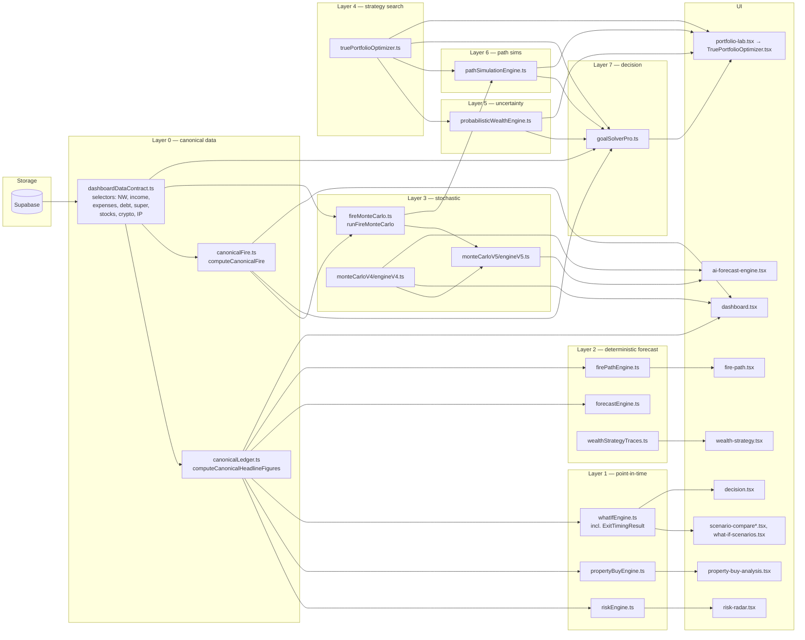
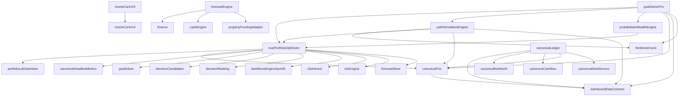

# Family Wealth Lab — Technical Guide

**Audience:** an engineer joining the codebase. Every claim below should be verifiable from a file:line reference in the current `main` branch. Where a claim relies on behavioural design rather than a single line of code, the closest authoritative line is cited and the design is summarised verbatim from existing audit reports under `docs/`.

**Snapshot:** `main` at commit `bd77ec0` (Sprint 10 merged). Sprint 11 has not started.

---

## 1. Architecture Map

The engines compose as a strict 8-layer stack. Each layer reads only from the layers below it (with two documented exceptions: see §1.2).

```
Layer 7  Decision               goalSolverPro.ts                 (Sprint 10)
Layer 6  Path simulation        pathSimulationEngine.ts          (Sprint 9)
Layer 5  Assumption uncertainty probabilisticWealthEngine.ts     (Sprint 8)
Layer 4  Strategy optimization  truePortfolioOptimizer.ts        (Sprint 7)
                                portfolioLabOptimizer.ts         (Sprint 6 Ph 5)
Layer 3  Stochastic forecast    fireMonteCarlo.ts (FireMC v5)
                                monteCarloV5/engineV5.ts
                                monteCarloV4/engineV4.ts
Layer 2  Deterministic forecast forecastEngine.ts, firePathEngine.ts,
                                cashEngine.ts,
                                auditMode/engineTraces/wealthStrategyTraces.ts
Layer 1  Point-in-time engines  riskEngine.ts, propertyBuyEngine.ts,
                                canonicalPropertyEconomics.ts,
                                whatIfEngine.ts (incl. ExitTimingResult)
Layer 0  Canonical data         canonicalLedger.ts,
                                dashboardDataContract.ts,
                                canonicalFire.ts,
                                canonicalNetWorth.ts,
                                canonicalCashflow.ts,
                                canonicalDebtService.ts,
                                canonicalHeadlineMetrics.ts,
                                canonicalRiskSurface.ts,
                                canonicalPropertyEconomics.ts,
                                canonicalTax.ts, canonicalWealth.ts
```

### 1.1 Sprint provenance

| Sprint | Engine | Version constant | Default seed |
|---|---|---|---|
| Sprint 4 | `canonicalLedger`, `canonicalFire`, `dashboardDataContract` | none (selectors) | n/a |
| Sprint 5/6 | `portfolioLabOptimizer`, `decisionCandidates`, `decisionRanking`, `bestMoveEngineSprint5` | n/a | n/a |
| Sprint 6 | `scenarioCompareWorkspace`, `scenarioBuilderWorkspace` | n/a | n/a |
| Sprint 7 | `truePortfolioOptimizer` | (none surfaced) | n/a (deterministic) |
| Sprint 8 | `probabilisticWealthEngine` | assumption set `"sprint8-v1.0"` (`probabilisticWealthEngine.ts:97`) | `DEFAULT_SEED=8` (`probabilisticWealthEngine.ts:534`) |
| Sprint 9 | `pathSimulationEngine` | `PATH_SIM_ENGINE_VERSION="sprint-9.path-sim.v1"` (`pathSimulationEngine.ts:78`) | `DEFAULT_PATH_SIM_SEED=9` (`pathSimulationEngine.ts:82`) |
| Sprint 10 | `goalSolverPro` | `PATH_GOAL_SOLVER_VERSION="sprint-10.goal-solver.v1"` (`goalSolverPro.ts:43`) | `DEFAULT_GOAL_SOLVER_SEED=10` (`goalSolverPro.ts:44`) |
| FireMC | `fireMonteCarlo` | none | `DEFAULT_FIRE_MC_SEED = 0x46_57_4c_4d` (`"FWLM"`, `fireMonteCarlo.ts:51`) |

### 1.2 Exceptions to layer ordering

- **Sprint 8 imports Sprint 7 types** — `probabilisticWealthEngine.ts:40-44` imports `TruePortfolioOptimizerResult` / `ScenarioRecord` / `Recommendation` / `ScenarioMetric`. Sprint 8 is **read-only** over Sprint 7. (`docs/sprint-9-audit-report.md:155` confirms regression test §16 verifies no mutation.)
- **Sprint 9 also imports Sprint 7 + FireMC** — `pathSimulationEngine.ts:45-67`. Strategy candidates come from Sprint 7; per-path stochastic draws come from FireMC v5 (`fireMonteCarlo.ts:483 runFireMonteCarlo`).
- **Sprint 10 imports Sprint 7, 8, 9** — `goalSolverPro.ts:22-41`. Pure orchestration over the three layers below.

---

## 2. Data Flow Diagram



---

## 3. Engine Dependency Diagram

Verified by grepping `from "./<engine>"` imports across `client/src/lib/`. Direction: A → B means "A imports B".



---

## 4. Page-to-Engine Mapping Table

Routes are defined in the page filename → React component mapping (`client/src/pages/*.tsx`). Engine column lists the canonical imports the page resolves through.

| Route / page file | Component(s) | Engines consumed |
|---|---|---|
| `client/src/pages/dashboard.tsx` | inline | `dashboardDataContract` (selectors, line 82-94), `canonicalLedger` (line 89-90), `canonicalHeadlineMetrics` (line 94), `canonicalFire` (line 100), `monteCarloV4/engineV4` `runMonteCarloV4` (line 191), `cashEngine` (line 13), `equityEngine` (line 48), `canonicalWealth` (line 49), `canonicalRiskSurface` (line 50), `bestMoveEngine` (line 174), `monteCarloCanonical` (line 190) |
| `client/src/pages/portfolio-lab.tsx` | `TruePortfolioOptimizer.tsx` | `riskEngine` (line 19). The component then internally consumes `truePortfolioOptimizer` (Sprint 7), `probabilisticWealthEngine` (Sprint 8), `pathSimulationEngine` (Sprint 9), `goalSolverPro` (Sprint 10), `canonicalFire` |
| `client/src/pages/fire-path.tsx` | inline | `firePathEngine` (line 33), `cashEngine` (line 37), `auditMode/engineTraces` (line 41) |
| `client/src/pages/risk-radar.tsx` | `RiskRadarCard.tsx` | `riskEngine` (line 16) |
| `client/src/pages/property-buy-analysis.tsx` | `PropertyBuyWidget.tsx` | `propertyBuyEngine` (line 38) |
| `client/src/pages/wealth-strategy.tsx` | inline | `wealthStrategyTraces` (line 32) + `forecastEngine` (transitively, via the chart data series) |
| `client/src/pages/ai-forecast-engine.tsx` | `MonteCarloV4Panel.tsx`, `MonteCarloV5Panel.tsx` | `monteCarloV4` (line 43), `monteCarloV5` (line 45) |
| `client/src/pages/what-if-scenarios.tsx` | inline | `whatIfEngine` (line 64; includes `ExitTimingResult`, `runScenarioForecast`, `runGoalSolver`, `runWiMonteCarlo`) |
| `client/src/pages/scenario-compare-workspace.tsx` | `ScenarioCompareWorkspace.tsx` | `riskEngine` (line 21), `scenarioCompareWorkspace` (via component) |
| `client/src/pages/scenario-compare.tsx`, `scenario-compare-v2.tsx` | inline | `whatIfEngine`, `scenarioCompareWorkspace` |
| `client/src/pages/decision.tsx` | `decisionEngine/*.tsx` (Sprint 5 panel) | Aggregates `whatIfEngine`, `decisionCandidates`, `decisionRanking` |
| `client/src/pages/reports.tsx` | inline | `canonicalFire` (line 30) |
| `client/src/pages/goal-closure-lab.tsx` | `GoalClosureLab.tsx` | `riskEngine` (line 17), `goalClosureLab` lib |
| `client/src/pages/stocks.tsx`, `crypto.tsx` | inline | `finance` (projectInvestment, calcCAGR), `marketData` (live prices). **No bespoke growth engine** — projection uses `finance.ts` helpers and FireMC parameters elsewhere |
| `client/src/pages/property.tsx`, `property-buy-analysis.tsx` | `PropertyLifecycleAnalysis.tsx`, `PropertyBuyWidget.tsx` | `propertyBuyEngine`, `canonicalPropertyEconomics`, `propertyTimelineBuilder` |
| `client/src/pages/cgt-simulator.tsx` | inline | uses `property_exit_full` action type (`cgt-simulator.tsx:1761`) — see Exit Strategy §5.10 |

---

## 5. Per-Engine Reference

For each major engine: path, version constant, public API, key internals, defaults, determinism, mutation behaviour.

### 5.1 `canonicalLedger.ts`

- **Path:** `client/src/lib/canonicalLedger.ts` (193 lines)
- **Public API:**
  - `computeCanonicalHeadlineFigures(ledger)` (`canonicalLedger.ts:78-109`) → `CanonicalHeadlineFigures`
  - `reconcileCanonicalLedger(canonical, pageSnapshots, tolerance=1)` (`canonicalLedger.ts:134-164`) → `ReconciliationResult[]`
  - `buildCanonicalAuditTrace(ledger)` (`canonicalLedger.ts:172-193`)
- **Types:** `CanonicalHeadlineFigures` (line 48-75), `PageHeadlineSnapshot` (line 116-120), `ReconciliationResult` (line 122-127)
- **Reason for existence:** Sprint 4A audit found the same household rendering different headline values across pages (`canonicalLedger.ts:3-22`). This module is the cross-page reconciliation point: any page that disagrees with `computeCanonicalHeadlineFigures` by more than $1 fails reconciliation.
- **Mutation:** Pure. No input is ever mutated.

### 5.2 `dashboardDataContract.ts`

- **Path:** `client/src/lib/dashboardDataContract.ts` (1027 lines)
- **Public API (selectors used by every downstream engine):**
  - `selectMonthlyIncome`, `selectMonthlyExpensesLedger`, `selectMonthlySurplus` (`dashboardDataContract.ts:641-648`), `selectMonthlyDebtService`, `selectMortgageRepayment`, `selectSettledIpDebtService`, `selectOtherDebtRepayment`
  - `selectCanonicalNetWorth` (`dashboardDataContract.ts:771-810`) → `CanonicalNetWorth`
  - `selectPassiveIncome`, `selectStocksTotal`, `selectCryptoTotal`, `selectSuperCombined`
  - `selectIpCurrentValueSettled`, `selectIpLoanBalanceSettled`, `selectIpCurrentValuePlanned`, `selectIpLoanBalancePlanned`
  - `selectExpensesIncludesDebt` (`dashboardDataContract.ts:600-613`), `selectCashToday` (line 650-661), `evaluateDataAvailability` (line 682-709)
- **Declarative contract:** `KPI_DATA_CONTRACT` (`dashboardDataContract.ts:64-...`) is consumed by `script/test-dashboard-contract.ts` to assert every card's bindings exist.
- **Surplus debt-aware mode (regression bait):** `selectMonthlySurplus` has two modes, gated by `selectExpensesIncludesDebt`. Mode A: `income - expenses`. Mode B: `income - expenses - mortgageRepayment - otherDebtRepayment - settledIpDebtService` (`dashboardDataContract.ts:641-648`). History of bugs is documented in-file (line 632-639).
- **Mutation:** Pure. Defensive `Number(x ?? 0)` coercions throughout.

### 5.3 `canonicalFire.ts`

- **Path:** `client/src/lib/canonicalFire.ts` (180 lines)
- **Public API:**
  - `computeCanonicalFire(ledger, opts)` (`canonicalFire.ts:92-142`) → `CanonicalFire`
  - `resolveFireTargetFromSnapshot(ledger, opts)` (`canonicalFire.ts:154-165`)
  - `selectFireMonthlyContribution(ledger)` (`canonicalFire.ts:173-180`)
- **Formula:**
  - `fireNumber = targetAnnualIncome / (swrPct/100)` (`canonicalFire.ts:120`)
  - `progressFraction = clamp(netWorth / fireNumber, 0, 1)` (`canonicalFire.ts:121-123`)
  - `passiveCoverage = (annualPassive/12) / monthlyExpenses` (null when expenses=0) (`canonicalFire.ts:124-126`)
  - `gap = max(0, fireNumber - netWorth)` (`canonicalFire.ts:139`)
- **SWR clamp:** `clampSwr(raw)` returns 4% if raw < 2 or > 8 (`canonicalFire.ts:78-84`)
- **Target precedence:** explicit `opts.targetMonthlyIncome` > `snapshot.fire_target_monthly_income` > monthly expenses > empty (`canonicalFire.ts:101-118`)

### 5.4 `forecastEngine.ts`

- **Path:** `client/src/lib/forecastEngine.ts` (217 lines)
- **Public API:**
  - `buildForecast(input)` (`forecastEngine.ts:90-185`) → `ForecastOutput`
  - `buildAssumptionsFromStore(mode, profile, yearlyAssumptions, profileDefaults)` (`forecastEngine.ts:190-217`)
- **Modes:** `'profile' | 'year-by-year' | 'monte-carlo'` (`forecastEngine.ts:7-13`). In monte-carlo mode, falls back to profile if no last MC run is available.
- **Composition:** internally calls `buildCashFlowSeries`, `projectNetWorth`, `aggregateCashFlowToAnnual` from `finance.ts`, plus `runCashEngine` from `cashEngine.ts`, plus `applyFundingToProperties` from `propertyFundingAdapter.ts`.
- **Output:** `{ monthly, annual, netWorth, cashEngine }` (`forecastEngine.ts:59-65`).
- **Mutation:** Pure with one transformation: `applyFundingToProperties` produces effective property records before forecast (`forecastEngine.ts:103-106`).

### 5.5 `firePathEngine.ts`

- **Path:** `client/src/lib/firePathEngine.ts` (963 lines)
- **Purpose:** FIRE Fastest Path Optimizer (v2, fully data-driven). Compares 4 strategies: A) Property Focused, B) ETF/Stock Focused, C) Mixed, D) Aggressive (`firePathEngine.ts:8-12`).
- **Inputs:** `FIRESettings` (mirrors `sf_fire_settings` row) (`firePathEngine.ts:35-86`), `FIREScenarioConfig` (mirrors `sf_fire_scenario_config`) (`firePathEngine.ts:89+`).
- **Simulation:** monthly compound loop, max 40 years; SGC+salary sacrifice for super; mortgage amortised on remaining term + rate; FIRE triggered when accessible investable ≥ target_capital; super excluded from accessible unless `include_super_in_fire` (`firePathEngine.ts:14-23`).
- **All assumptions data-driven:** "ALL assumptions come from `FIRESettings` — zero hardcoded constants" (`firePathEngine.ts:3-4`); labelled hardcoded fallbacks are documented inline.

### 5.6 `fireMonteCarlo.ts` (FireMC v5 — used internally by Sprint 9)

- **Path:** `client/src/lib/fireMonteCarlo.ts` (1277 lines)
- **Public API:**
  - `runFireMonteCarlo(settings, planInput?, seed=DEFAULT_FIRE_MC_SEED)` (`fireMonteCarlo.ts:483-490`)
  - `applyPreset(base, key)` (`fireMonteCarlo.ts:453-455`)
- **Constants:**
  - `DEFAULT_FIRE_MC_SEED = 0x46_57_4c_4d` ("FWLM") (`fireMonteCarlo.ts:51`)
  - `DEFAULT_FIRE_MC_SETTINGS` (`fireMonteCarlo.ts:346-407`) — fully populated baseline (`startMonthlyIncome:22000`, `startMonthlyExpenses:14540`, `targetPassiveMonthly:20000`, `swrPct:4.0`, etc.)
  - `PRESET_OVERRIDES` (`fireMonteCarlo.ts:413-451`) — 7 presets: conservative/base/growth/aggressive/property_heavy/stock_heavy/custom
- **Simulation guarantees:**
  - simulationCount clamped to `[100, 10000]` (`fireMonteCarlo.ts:490`)
  - Seeded Mulberry32 RNG when `seed != null` (`fireMonteCarlo.ts:39-48, 493`)
  - 4-factor Cholesky correlation (`fireMonteCarlo.ts:61-83`): stocks, crypto, inflation, property
  - Box-Muller normals (`fireMonteCarlo.ts:28-34`)
- **FIRE trigger:** `investable NW ≥ annual_passive / (SWR/100)` (`fireMonteCarlo.ts:11`)
- **Random events:** job loss, market crash, rate jump, recession, bull market, windfall, large expense (`fireMonteCarlo.ts:148-161`).

### 5.7 `truePortfolioOptimizer.ts` (Sprint 7)

- **Path:** `client/src/lib/truePortfolioOptimizer.ts` (1547 lines)
- **Public API:** `buildTruePortfolioOptimizer(inputs)` → `TruePortfolioOptimizerResult` (see types `TruePortfolioOptimizerInputs:359-368`, `TruePortfolioOptimizerResult:370-385`)
- **Scenario dimensions** (`truePortfolioOptimizer.ts:154-183`):
  - `PropertyMode`: `"none" | "buy-investment-property" | "delay-purchase"`
  - `InvestmentMode`: `"etf" | "stock" | "crypto" | "none"`
  - `CashMode`: `"offset-contribution" | "cash-reserve-increase" | "debt-reduction" | "hold"`
  - Plus `propertyYear`, `riskTolerance: "low"|"moderate"|"high"`, `targetFireYear`
- **Scenario capacity:** `DEFAULT_CAPACITY = 12_000`, `MIN_TARGET_SCENARIOS = 1_000`, `HARD_CAPACITY_CEILING = 100_000` (`truePortfolioOptimizer.ts:389-391`)
- **Sections (per result):** `goalReverseEngineering`, `scenarios[]`, `recommendations[]` (5 categories), `gapSolver`, `frontier` (efficient frontier — `pareto: true` flag), `searchMetrics`, `auditTrail`
- **Recommendation categories** (`truePortfolioOptimizer.ts:243-248`): `"fire-speed" | "risk-adjusted" | "cashflow" | "probability" | "hybrid"`
- **Frontier objectives** (`truePortfolioOptimizer.ts:295-300`): `"fastest-fire" | "highest-probability" | "lowest-risk" | "highest-networth" | "best-risk-reward"`
- **Mutation:** Pure. Verified by Sprint 9 audit §16 (`docs/sprint-9-audit-report.md:154`) and Sprint 10 audit §15.
- **Constraint contract** (`truePortfolioOptimizer.ts:135-150`): `OptimizerConstraints` — `maxRiskScore`, `maxDebt`, `maxMonthlyContribution`, `maxPropertyCount`, `minLiquidityMonths`, `targetFireYear`.

### 5.8 `probabilisticWealthEngine.ts` (Sprint 8)

- **Path:** `client/src/lib/probabilisticWealthEngine.ts` (1097 lines)
- **Public API:** `buildProbabilisticWealthEngine(inputs)` (`probabilisticWealthEngine.ts:537-...`) → `ProbabilisticWealthEngineResult`
- **Defaults:**
  - `DEFAULT_ASSUMPTION_SET` version `"sprint8-v1.0"` (`probabilisticWealthEngine.ts:96-163`)
  - `DEFAULT_SIMS_PER_STRATEGY = 1_000` (`probabilisticWealthEngine.ts:532`)
  - `DEFAULT_SEED = 8` (`probabilisticWealthEngine.ts:534`)
- **Assumption ranges** (13 drivers) — each declares `{mean, stdDev, min, max, notEngineModelled, note}`:
  - Engine-modelled (10): propertyCapitalGrowth, rentGrowth, vacancy, interestRates, inflation, etfReturn, incomeGrowth, expenseInflation, taxImpact, debtServiceStress
  - `notEngineModelled: true` (3): cryptoReturn (`probabilisticWealthEngine.ts:128-132`), maintenanceCost (line 143-147), sellingCost (line 148-152)
- **Outputs per strategy** (`probabilisticWealthEngine.ts:179-218`):
  - `probabilityFireSuccess`, `probabilityLiquidityStress`, `probabilityNegativeCashflow`, `probabilityForcedSale` (integer %)
  - Bands (p10/p50/p90): `netWorthBand`, `passiveIncomeBand`, `fireYearBand`, `requiredMonthlyContributionBand`
  - `deterministicScore`, `monteCarloConfidence`, `robustScore` (blend)
- **Determinism:** Mulberry32 PRNG (`probabilisticWealthEngine.ts:290-298`).
- **Rounding policy:** probability outputs rounded to integer percent; net-worth bands to nearest $1,000 (`probabilisticWealthEngine.ts:30-32`).

### 5.9 `pathSimulationEngine.ts` (Sprint 9)

- **Path:** `client/src/lib/pathSimulationEngine.ts` (1193 lines)
- **Public API:** `buildPathSimulationEngine(inputs)` → `PathSimulationResult`
- **Constants** (`pathSimulationEngine.ts:78-84`):
  - `PATH_SIM_ENGINE_VERSION = "sprint-9.path-sim.v1"`
  - `DEFAULT_PATH_SIMS_PER_STRATEGY = 1_000`
  - `MIN_PATH_SIMS_PER_STRATEGY = 1_000` (clamp floor)
  - `DEFAULT_MAX_PATH_STRATEGIES = 5`
  - `DEFAULT_PATH_SIM_SEED = 9`
  - `HORIZON_FLOOR_YEARS = 5`, `HORIZON_CEILING_YEARS = 40`
- **Pipeline** (`docs/sprint-9-audit-report.md:25-50`):
  1. `computeCanonicalFire(...)` to resolve target FIRE year
  2. If `sprint7Result.empty`, return empty result (no FireMC calls)
  3. `pickTopPathStrategies(...)` — recommended scenario + up to N from ranking, dedup by id
  4. `buildBaseSettings(...)` — read `mc_fire_settings` with `DEFAULT_FIRE_MC_SETTINGS` fallback; starting balances **never overwritten** from canonical ledger
  5. Per-strategy `runStrategy(...)` → one `runFireMonteCarlo(settings, planInput, seed)` with `simulationCount = simsPerStrategy` (clamped ≥1000)
  6. `runDriverSensitivity(...)` for the best strategy — 7 additional FireMC calls (one per driver), each with `simulationCount = lightSims = 200`
- **Tilts** (`pathSimulationEngine.ts:98-190`):
  - `PROPERTY_TILTS` — none/buy/delay
  - `INVESTMENT_TILTS` — etf (engine-modelled), `stock` flagged `notEngineModelled: true` (line 149), crypto (engine-modelled), none
  - `CASH_TILTS` — offset-contribution / cash-reserve-increase / debt-reduction / hold (all engine-modelled)
- **Per-output traceability** is documented in full at `docs/sprint-9-audit-report.md:54-68`.
- **Synthesised outputs (honest framing):**
  - `representativePaths.sourceIndex = -1` flags synthesised paths derived from `netWorthFan` percentile slices (P10/P50/P90), not real per-path samples (`docs/sprint-9-audit-report.md:128-131`). See §9.1 below.
- **Determinism:** seeded; same seed ⇒ identical bands (verified by Sprint 9 regression §4).

### 5.10 `goalSolverPro.ts` (Sprint 10)

- **Path:** `client/src/lib/goalSolverPro.ts` (1620 lines)
- **Public API:** `buildGoalSolverPro(inputs)` → `GoalSolverProResult` (types `GoalSolverProInputs:249-259`, `GoalSolverProResult:230-245`)
- **Constants:** `PATH_GOAL_SOLVER_VERSION` (line 43), `DEFAULT_GOAL_SOLVER_SEED = 10` (line 44)
- **Pipeline** (7 steps + audit; see also `docs/sprint10-audit-report.md:36-65`):
  1. Empty-state detection (`goalSolverPro.ts:~1430`)
  2. Constraint Solver (`buildConstraints`, `goalSolverPro.ts:850-1006`) — per-constraint elimination tracking
  3. Feasibility (`buildFeasibility`, `goalSolverPro.ts:393-448`) — thresholds P≥0.70 ACHIEVABLE / P≥0.40 STRETCH / P≥0.10 UNLIKELY / else IMPOSSIBLE (line 387-390)
  4. Gap Analysis (`buildGap`, `goalSolverPro.ts:480-742`) — `shortfall = max(0, target - actual)` (or invert for less-is-better fields)
  5. Reverse Engineering (`buildRequiredInputs`, `goalSolverPro.ts:776-846`)
  6. Optimization Search (`optimizationSearch`, `goalSolverPro.ts:1036-1195`) — 8 objectives
  7. Action Plan (`buildActionPlan`, `goalSolverPro.ts:1199-1306`)
  8. Audit Trail (`buildAuditTrail`, `goalSolverPro.ts:1310-...`)
- **GapField types** (11) (`goalSolverPro.ts:94-105`): `netWorth | passiveIncomeAnnual | passiveIncomeMonthly | fireYear | propertyCount | portfolioValue | debt | monthlyContribution | risk | liquidity | retirementYear`
- **OptimizationObjective types** (8) (`goalSolverPro.ts:186-194`)
- **Investable-assets aggregate (Q3 fix):** `selectInvestableAssetsCanonical(i)` (`goalSolverPro.ts:308-322`). Formula in §6.
- **`requiredSavingsRate`:** `goalSolverPro.ts:817-826` — `requiredMonthlyDCA / (roham_monthly_income + fara_monthly_income)`, clamped `[0, 1]`.
- **Exit Strategy lives elsewhere:** the Sprint 10 result does not surface an explicit exit-strategy field. Exit timing analysis is `ExitTimingResult` inside `whatIfEngine.ts:1785-1909` and is consumed by `what-if-scenarios.tsx`. The Sprint 10 action plan reads property purchase years from `dimensions.propertyYear`; it does not synthesise property exit years.

### 5.11 `riskEngine.ts`

- **Path:** `client/src/lib/riskEngine.ts`
- **Public API:** `buildRiskInput(...)`, `computeRiskRadar(input)` → `RiskRadarResult`
- **Dimensions** (4) (`riskEngine.ts:8-15`): Debt Risk (LVR, debt ratio, IR exposure), Cashflow Risk (buffer months, surplus ratio, bill concentration), Investment Risk (crypto concentration, diversification, vol exposure), Income Risk (single vs dual income, stability, emergency fund)
- **Scoring:** 0–100 per dimension (100 = safest). Overall = weighted average. Level: `green` (≥70), `amber` (40–69), `red` (<40) (`riskEngine.ts:13-15`).
- **`fragility_index`:** inverse of overall (0 = resilient, 100 = fragile) (`riskEngine.ts:62`)
- **`data_coverage`:** `'full' | 'partial' | 'minimal'` (`riskEngine.ts:63`)

### 5.12 `propertyBuyEngine.ts`

- **Path:** `client/src/lib/propertyBuyEngine.ts`
- **Public API:** `calcStampDuty(price, state)` (`propertyBuyEngine.ts:48-...`) + scenario builders for Buy Now / Wait 6 / Wait 12.
- **States supported:** QLD, NSW, VIC, SA, WA, TAS, NT, ACT (`propertyBuyEngine.ts:39-45`).
- **Outputs per scenario** (`propertyBuyEngine.ts:6-17`):
  - Net worth after N years, equity created, total cash invested, annual cashflow impact, IRR (Newton-Raphson NPV solver), opportunity cost of waiting, offset vs deposit tradeoff.
- **AU specifics** (`propertyBuyEngine.ts:22-28`): stamp duty per state, NG (rental loss × marginal rate via `auMarginalRate`), div 43 + div 40 depreciation (simplified), CGT 50% discount > 12 months. Land tax excluded.
- **Pure engine:** "no Supabase reads in this file" (`propertyBuyEngine.ts:19-21`). Data passed in by caller.

### 5.13 `monteCarloV4` and `monteCarloV5`

- **`monteCarloV4/engineV4.ts`** — base MC v4. `runMonteCarloV4(input, config)` produces fan + FIRE prob + V4 extras. Module barrel exports rates/regimes/events/behavioural/risk/optimizer/explanations (`monteCarloV4/index.ts:13-23`).
- **`monteCarloV5/engineV5.ts` (295 lines)** — non-destructive layer over V4. `runMonteCarloV5(input, config)` returns the V4 output unchanged in `result.*` and adds enrichments under `result.v5`:
  - `v5RegimeByYear`, `overlayByYear`, `shockSummary`, `household` (timeline + yearly totals), `propertyRealism[]`, `portfolio` (intelligence), `contributionPlan`, `fire` (V2), `narratives[]` (V3 multi-tone), `transparency`, `validations[]`, `rerankedRecommendations` (`monteCarloV5/engineV5.ts:71-92`).

### 5.14 `wealthStrategyTraces.ts`

- **Path:** `client/src/lib/auditMode/engineTraces/wealthStrategyTraces.ts`
- **Trace IDs** (`wealthStrategyTraces.ts:14-20`):
  - `wealth-strategy:cash-buffer` — `Cash / Monthly Expenses` (line 39-67)
  - `wealth-strategy:savings-rate`
  - `wealth-strategy:debt-to-assets`
  - `wealth-strategy:freedom-progress`
  - `wealth-strategy:net-position`
- **Input contract:** `WealthStrategyTraceArgs` (line 22-31) — `cash`, `monthlyExpenses`, `monthlyIncome`, `monthlySurplus`, `totalAssets`, `totalDebt`, `investableAssets`, `fireTarget`.
- **No new math:** "values are pinned from the page's existing scope and substituted into the formula strings" (`wealthStrategyTraces.ts:5-8`).

### 5.15 `whatIfEngine.ts` (incl. Exit Strategy)

- **Path:** `client/src/lib/whatIfEngine.ts` (2276 lines)
- **Public API surface (selected):**
  - `runScenarioForecast(...)` (line 359)
  - `runGoalSolver(...)` (line 762) — distinct from Sprint 10 `goalSolverPro`; this is the per-scenario goal solver in the Decision/What-If page
  - `runWiMonteCarlo(...)` (line 897)
  - Supabase IO: `loadScenarios`, `saveScenario`, `deleteScenario`, `loadScenarioProperties`, `saveProperty`, `deleteProperty`, `loadScenarioStockPlans`, `saveStockPlan`, `loadScenarioCryptoPlans`, `saveCryptoPlan`, `loadScenarioAssumptions`, `saveAssumptions`, `saveScenarioResult`, `cloneBasePlan` (lines 1053-1204)
  - `ExitTimingResult` (line 1785-1796) — exit-timing analysis output. Fields: `holdMonthlyIncome` (line 1790), `rows[]` (each with `isOptimalTradeoff: boolean`, line 1782).
  - `ExitAssetSelection` (line 1205), `ReinvestmentAllocation` (line 1216)
- **Exit timing logic:** the optimal-tradeoff year is the `r.year === optimalTradeoffYear` row (line 1895). `holdMonthlyIncome = forecastResult.projectedPassiveIncome` (line 1903). The action timeline narrative reads `optimal = exitTiming.rows.find(r => r.isOptimalTradeoff)` and reports gain over hold (lines 2144-2147).

### 5.16 `scenarioCompareWorkspace.ts`, `scenarioBuilderWorkspace.ts` (Sprint 6)

- **`scenarioCompareWorkspace.ts`** (658 lines):
  - `ScenarioId` type (line 69-76), `ScenarioDefinition` (line 77-87), `SCENARIO_DEFINITIONS[]` (line 88-145)
  - Result types: `ScenarioMetric` (line 146), `ScenarioRow` (line 161-187), `ScenarioCompareWorkspaceInputs` (line 188-198), `ScenarioCompareWorkspaceResult` (line 199-...)
  - `buildScenarioCompareWorkspace(...)` (line 463)
  - `formatScenarioMetric(m)` (line 622)
- **`scenarioBuilderWorkspace.ts`** (695 lines) — builder-side workspace
- **UI:** `ScenarioCompareWorkspace.tsx`, `ScenarioBuilderWorkspace.tsx`

---

## 6. Formula Reference

Every formula in current use across the platform, with file:line citations. Formulas not listed are presumed to be either trivial (e.g. `a + b`) or to live in `finance.ts` as pure helpers.

### 6.1 Canonical FIRE

| Formula | Citation |
|---|---|
| `fireNumber = targetAnnualIncome / (swrPct / 100)` | `canonicalFire.ts:120` |
| `progressFraction = clamp(netWorth / fireNumber, 0, 1)` | `canonicalFire.ts:121-123` |
| `passiveCoverage = (annualPassive / 12) / monthlyExpenses` (null when expenses=0) | `canonicalFire.ts:124-126` |
| `gap = max(0, fireNumber - netWorth)` | `canonicalFire.ts:139` |
| SWR clamp: `swrPct ∈ [2, 8]` else default 4 | `canonicalFire.ts:78-84` |

### 6.2 Canonical Net Worth

`netWorth = totalAssets − totalLiabilities` where (`dashboardDataContract.ts:771-810`):

```
totalAssets =
    ppor
  + cashOffset                  (selectCashToday)
  + superCombined               (selectSuperCombined)
  + stocks                      (selectStocksTotal)
  + crypto                      (selectCryptoTotal)
  + settledIpValue              (selectIpCurrentValueSettled)
  + cars
  + iranProperty
  + otherAssets

totalLiabilities =
    ppoMortgage
  + settledIpLoans              (selectIpLoanBalanceSettled)
  + otherDebts
```

Planned IP equity is computed separately as `plannedIpValue − plannedIpLoans` and excluded from current NW (`dashboardDataContract.ts:792-794`).

### 6.3 Monthly Surplus (debt-aware)

`dashboardDataContract.ts:641-648`:

```
if selectExpensesIncludesDebt(i):   surplus = round(income − expenses)
else:                               surplus = round(income − expenses − monthlyDebtService)
```

Where `monthlyDebtService = mortgageRepayment + settledIpDebtService + otherDebtRepayment`.

### 6.4 Sprint 10 — Investable Assets Aggregate (Q3 fix)

`goalSolverPro.ts:308-322`:

```
investableAssets =
    snapshot.cash
  + snapshot.offset_balance
  + selectSuperCombined(ledger)
  + selectStocksTotal(ledger)
  + selectCryptoTotal(ledger)
  + (selectIpCurrentValueSettled(ledger) − selectIpLoanBalanceSettled(ledger))
```

**PPOR equity is intentionally excluded.** Investment-property equity is included via the canonical IP selectors (`goalSolverPro.ts:295-307`). This is a point-in-time aggregate, not a projection.

### 6.5 Sprint 10 — Required Savings Rate

`goalSolverPro.ts:817-826`:

```
monthlyIncome = snapshot.roham_monthly_income + snapshot.fara_monthly_income
requiredSavingsRate = clamp(requiredMonthlyDCA / monthlyIncome, 0, 1)
```

Null when ledger missing or income is 0.

### 6.6 Sprint 10 — Optimization Objectives (8)

All formulas are ratios or selectors over Sprint 7 + Sprint 9 outputs. None introduces a new forecast.

| Objective | Selector | Citation |
|---|---|---|
| Fastest FIRE | `argmin medianFireYear` | `goalSolverPro.ts:1079, 1113-1121` |
| Highest Probability | `argmax probabilityFireByTarget` | `goalSolverPro.ts:1080, 1122-1131` |
| Lowest Risk | `argmin (probCashShortfall + probNegCashflow)` | `goalSolverPro.ts:1081-1086, 1132-1141` |
| Best Hybrid | `argmax (robustScore × probabilityFireByTarget)` | `goalSolverPro.ts:1104-1109, 1142-1151` |
| Highest Net Worth | `argmax netWorthBand.p50` | `goalSolverPro.ts:1087, 1152-1161` |
| Best Passive Income | `argmax passiveIncomeBand.p50` | `goalSolverPro.ts:1088, 1162-1171` |
| Best Debt-Adjusted | `argmax (netWorthBand.p50 / max(1, householdDebt))` | `goalSolverPro.ts:1089-1093, 1172-1181` |
| Best Liquidity-Adjusted | `argmax (netWorthBand.p50 / liquidityPosition)` | `goalSolverPro.ts:1094-1103, 1182-1191` |

The `bestPath` returned by `optimizationSearch(...)` is the **Best Hybrid** result (`goalSolverPro.ts:1194`).

### 6.7 Sprint 10 — Feasibility Thresholds

`goalSolverPro.ts:381-391`:

```
if hardConstraintViolated:                  IMPOSSIBLE
elif prob == null or NaN:                   UNLIKELY
elif prob ≥ 0.70:                           ACHIEVABLE
elif prob ≥ 0.40:                           STRETCH
elif prob ≥ 0.10:                           UNLIKELY
else:                                       IMPOSSIBLE
```

When no targets are supplied, status is forced to `ACHIEVABLE` (`goalSolverPro.ts:404-407, 427-429`).

### 6.8 Sprint 10 — Gap Shortfall

`goalSolverPro.ts:464-477`:

```
if invert (less-is-better, e.g. debt/risk/fireYear):
    shortfall = max(0, actual - target)
else:
    shortfall = max(0, target - actual)
status = "shortfall" if shortfall > 0 else "met"
```

### 6.9 Sprint 9 — Probabilities

| Output | Derivation | Citation |
|---|---|---|
| `probabilityFireByTarget` | `Σ(fireYearHistogram[year ≤ targetFireYear]) / simulationCount` | `docs/sprint-9-audit-report.md:56` |
| `netWorthBand.p10/p50/p90` | `FireMCResult.nwP10AtTarget / nwP50AtTarget / nwP90AtTarget` (P25/P75 linearly interpolated) | `docs/sprint-9-audit-report.md:57` |
| `fireYearBand` | `FireMCResult.p10FireYear / medianFireYear / p90FireYear` (P25/P75 interpolated) | `docs/sprint-9-audit-report.md:58` |
| `passiveIncomeBand` | `(settings.swrPct / 100) × netWorthBand` | `docs/sprint-9-audit-report.md:59` |
| `netWorthFan[year]` | `FireMCResult.fanData` per-year P10/P25/P50/P75/P90 | `docs/sprint-9-audit-report.md:60` |
| `probabilityCurve` | Cumulative sum of `fireYearHistogram`; monotonic non-decreasing (enforced by regression §13) | `docs/sprint-9-audit-report.md:62` |
| `representativePaths` | **Synthesised** from netWorthFan P10/P50/P90 slices, `sourceIndex = -1` | `docs/sprint-9-audit-report.md:63` |
| `driverSensitivity[d]` | Δ in cumulative-histogram P(FIRE) and median fire year vs baseline, computed from a 1×200 FireMC call per perturbed driver (vol field doubled) | `docs/sprint-9-audit-report.md:46-48, 65` |

### 6.10 FIRE Monte Carlo (FireMC)

`fireMonteCarlo.ts`:

| Component | Formula / cite |
|---|---|
| FIRE trigger | `investable NW ≥ annual_passive / (SWR/100)` (`fireMonteCarlo.ts:11`) |
| Mortgage PMT | standard amortising payment: `P × r × (1+r)^n / ((1+r)^n − 1)` (`fireMonteCarlo.ts:340-342`); if r=0, `principal / n` |
| simulationCount clamp | `Math.max(100, Math.min(10000, settings.simulationCount ?? 5000))` (`fireMonteCarlo.ts:490`) |
| Correlated normals | Box-Muller (`fireMonteCarlo.ts:28-34`) × Cholesky lower-triangular 4×4 (`fireMonteCarlo.ts:61-100`) |
| Endpoint | simulate to age 65 minimum (`fireMonteCarlo.ts:497`) |

### 6.11 Sprint 8 — Robust Score

Per-strategy `robustScore` blends deterministic Sprint 7 score with stochastic Monte Carlo confidence (`probabilisticWealthEngine.ts:204-209`). See engine source for blend weights.

### 6.12 Sprint 7 — Recommendation categories

Each recommendation is the **best scenario** for its objective from the same evaluated pool (`truePortfolioOptimizer.ts:30-34`):

| Category | Notes |
|---|---|
| `fire-speed` | earliest projected FIRE year |
| `risk-adjusted` | best risk/reward — `riskEngine.overall_score` inverted as filter (`truePortfolioOptimizer.ts:136-139`) |
| `cashflow` | best cashflow position |
| `probability` | highest probability of success |
| `hybrid` | blend |

Tie-broken deterministically (`truePortfolioOptimizer.ts:32-34`).

### 6.13 Risk Engine

| Bucket level | Score |
|---|---|
| `green` | ≥ 70 |
| `amber` | 40–69 |
| `red` | < 40 |
| `fragility_index` | `100 − overall_score` (`riskEngine.ts:62`) |

### 6.14 Property Buy Engine (AU)

- **Stamp duty**: per-state piecewise functions in `propertyBuyEngine.ts:48-100`.
- **IRR**: Newton-Raphson NPV solver on cashflow series (`propertyBuyEngine.ts:14`).
- **NG benefit**: `rental_loss × marginal_income_tax_rate` (`propertyBuyEngine.ts:23`), where `marginal_income_tax_rate` comes from `auMarginalRate` in `finance.ts`.
- **CGT**: 50% discount for assets held > 12 months (`propertyBuyEngine.ts:27`).
- **Depreciation**: div 43 building + div 40 fixtures, simplified (`propertyBuyEngine.ts:24-25`).

### 6.15 Stocks / Crypto growth (no dedicated engine)

There is no dedicated stock-growth or crypto-growth engine file. Growth is handled in:

- `finance.ts` — `projectInvestment`, `calcCAGR` (used in `stocks.tsx` and `crypto.tsx` for per-asset projection).
- `fireMonteCarlo.ts` settings — `meanStockReturn / volStocks / meanCryptoReturn / volCrypto / rhoStocksCrypto / stockCorrectionProb / stockCorrectionSize / cryptoCrashProb / cryptoCrashSize / cryptoBullProb / cryptoBullUpside` (`fireMonteCarlo.ts:125-180`). Defaults documented at `fireMonteCarlo.ts:362-405`.
- `monteCarloV5/portfolioIntelligence.ts` and `correlatedShocks.ts` for V5 enrichments.

---

## 7. Determinism and Reproducibility

| Engine | Seed source | Determinism |
|---|---|---|
| `fireMonteCarlo` | `seed` arg, default `DEFAULT_FIRE_MC_SEED = 0x46_57_4c_4d` (`fireMonteCarlo.ts:51`). Passing `null` switches to `Math.random` (non-reproducible). | Same `(settings, planInput, seed)` ⇒ byte-identical `FireMCResult` (`fireMonteCarlo.ts:474-482`) |
| `probabilisticWealthEngine` | `inputs.seed ?? DEFAULT_SEED=8` (`probabilisticWealthEngine.ts:541`). Mulberry32 (`probabilisticWealthEngine.ts:290-298`). | Same inputs + seed ⇒ identical bands |
| `pathSimulationEngine` | `inputs.seed ?? DEFAULT_PATH_SIM_SEED=9` (`pathSimulationEngine.ts:82`). Calls `runFireMonteCarlo` with the same seed per strategy. | Verified by regression §4 (`docs/sprint-9-audit-report.md:142`) |
| `goalSolverPro` | `inputs.seed ?? DEFAULT_GOAL_SOLVER_SEED=10` (`goalSolverPro.ts:44`). Pure orchestration — seed is recorded for audit, no PRNG owned by Sprint 10. | Verified by regression §12 (`docs/sprint10-audit-report.md:147`) |
| `monteCarloV4/V5` | `hashSeed(seed)` + Mulberry32 (`monteCarloV4/rng.ts`, used by V5). | Same input/config ⇒ same output |

Simulation count clamps:

- FireMC: `[100, 10000]` (`fireMonteCarlo.ts:490`)
- Sprint 8: ≥ 1000 (`probabilisticWealthEngine.ts:542`)
- Sprint 9: ≥ 1000 (clamped via `MIN_PATH_SIMS_PER_STRATEGY`, `pathSimulationEngine.ts:80`); driver sensitivity uses `lightSims=200` per driver

---

## 8. Audit-Trail Standard

Sprint 10 introduced a standardised 8-field audit record. Every Sprint 10 section emits one. Earlier sprints emit subsets.

### 8.1 The 8 fields (`goalSolverPro.ts:68-77`)

| Field | Meaning |
|---|---|
| `enginesUsed` | List of engines this output read from |
| `inputsUsed` | Specific ledger/result fields read |
| `assumptionsUsed` | Named assumptions in play |
| `probabilitySource` | Where the probability number came from |
| `pathSource` | Where the band / fan / percentile came from |
| `constraintSource` | Where the constraint was checked |
| `confidenceSource` | Robust score / cross-validation source |
| `howCalculated` | Plain-English derivation string |

`defaultAudit(...)` (`goalSolverPro.ts:361-377`) seeds the 8 fields with values that every section then overrides with specifics.

### 8.2 Where audit fields land in the result

| Section | Audit location | Cite |
|---|---|---|
| Feasibility | `result.feasibility.audit` | `goalSolverPro.ts:91, 433-447` |
| Per-gap entry | `result.gap.entries[*].audit` | `goalSolverPro.ts:115, 468-477` |
| Required inputs | `result.requiredInputs.audit` | `goalSolverPro.ts:135, 836-845` |
| Per-constraint check | `result.constraints.checks[*].audit` | `goalSolverPro.ts:145, 870-880` |
| Per-blocker | `result.blockers[*].audit` | `goalSolverPro.ts:163, 967-973` |
| Per-path candidate | `result.bestPath.audit`, `result.alternativePaths[*].audit` | `goalSolverPro.ts:183, 1026-1033` |
| Per-action-plan entry | `result.actionPlan[*]` (`enginesUsed`, `inputsUsed`, `auditNote`) | `goalSolverPro.ts:212-215, 1218-1247` |
| Aggregated trail | `result.auditTrail[]` (`AuditEntry`) | `goalSolverPro.ts:217-228, 1310-...` |

### 8.3 Verification

Regression `script/test-sprint10-goal-solver-pro.ts` §11 asserts every audit entry has all 8 fields populated (`docs/sprint10-audit-report.md:145`).

Sprint 9 also emits per-entry audit (`enginesUsed`, `inputsUsed`, `assumptions`, `howCalculated`) — see `PathSimulationAuditEntry` (`pathSimulationEngine.ts:327-335`) and `PathSimulationAuditSection.metadata` (line 337-350) which carries `engineVersion`, `simulationsPerStrategy`, `seed`, `runtimeMs`.

---

## 9. Known Limitations / Honest Framing

Consolidated from `docs/sprint-9-audit-report.md`, `docs/sprint10-audit-report.md`, and verified in code.

### 9.1 Sprint 9 — `representativePaths.sourceIndex = -1`

`representativePaths` are **not** real per-path samples. They are synthesised from `netWorthFan` percentile slices (P10 / P50 / P90) and stamped with `sourceIndex: -1` to mark synthesis (`docs/sprint-9-audit-report.md:128-131`).

**Why this is acceptable:** the engine runs one `runFireMonteCarlo(N=1000)` per strategy rather than N×1 calls (`docs/sprint-9-audit-report.md:106-121`). The N×1 alternative was both ~150× slower and statistically *less* correct because it collapsed FireMC's intra-sim correlation. So the engine genuinely never has access to individual life-paths — only the aggregate fan. The representative paths surface what each percentile *would look like*, not what a single simulation *did*.

**UI implication:** any "show me path #137" feature would have to either re-run FireMC with `N=1` (re-introducing the slower, less-correct mode) or be honest that representative paths are envelope slices, not draws.

### 9.2 Sprint 10 — `gap.portfolioValue.actual` is point-in-time

Sprint 9 does not expose an investable-only band — only `netWorthBand` and `netWorthFan` (which include PPOR equity). Rather than synthesise a projection, Sprint 10's `gap[portfolioValue].actual` reads the **canonical point-in-time investable-assets aggregate** (formula §6.4) and the audit string names every source field (`goalSolverPro.ts:599-624`, `docs/sprint10-audit-report.md:186-235`).

**Regression guard:** §21 of the Sprint 10 regression test asserts two fixtures with identical investable assets but different PPOR equity ($800k vs $5m) produce identical `gap[portfolioValue].actual` (`docs/sprint10-audit-report.md:155-156, 229-234`). §22 asserts the value is no longer pointer-equivalent to `sprint9.bestStrategy.netWorthBand.p50`.

**Future work:** if a future sprint adds a projected investable-only band, this site can be migrated trivially (the audit string explicitly names the source).

### 9.3 Sprint 8 — three drivers are `notEngineModelled`

`cryptoReturn` (`probabilisticWealthEngine.ts:128-132`), `maintenanceCost` (line 143-147), `sellingCost` (line 148-152) carry `notEngineModelled: true` because no canonical engine differentiates them. They still perturb the simulation, but the flag propagates to the strategy's confidence-framing in the UI.

### 9.4 Sprint 7 dimensions with `notEngineModelled` propagation

- `INVESTMENT_TILTS.stock = { notEngineModelled: true }` (`pathSimulationEngine.ts:149`) — single-stock concentration is not modelled distinctly from ETF stock returns. Any Sprint 9 strategy with `dimensions.investment === "stock"` carries the flag.
- Driver `cryptoReturn` is per-driver-modelled but flagged `notEngineModelled` in driver sensitivity (`docs/sprint-9-audit-report.md:95-97`).

### 9.5 Pre-existing TS errors

There are pre-existing TypeScript errors in `cfoEngine.ts` and `dashboard.tsx` that pre-date Sprints 7-10. They are not in scope for any Sprint 7+ engine work.

### 9.6 Decision Engine — name collision

The user's term "Decision Engine" refers to Sprint 10's Goal Solver Pro (`goalSolverPro.ts`). The codebase also contains:

- `decisionCandidates.ts`, `decisionRanking.ts`, `decisionEngineLabels.ts` — Sprint 5/6 building blocks consumed by `truePortfolioOptimizer` (`truePortfolioOptimizer.ts:67-74`).
- `client/src/components/decisionEngine/Sprint5DecisionPanel.tsx` — Sprint 5 panel still rendered on `decision.tsx`.
- `client/src/pages/decision.tsx` — the V3 Unified Decision Engine page (`decision.tsx:1-19`). This page is built on `whatIfEngine.ts` (not `goalSolverPro.ts`). Two tabs: Quick Decision + Advanced Builder.

The "Decision Engine" in modern Family Wealth Lab vocabulary refers to Sprint 10 specifically.

### 9.7 Two "goal solvers"

- **`goalSolverPro.ts`** (Sprint 10) — top-level orchestrator, reads Sprint 7/8/9.
- **`goalSolver.ts`** + `runGoalSolver` in `whatIfEngine.ts:762` — older per-scenario goal solver used by the V3 Decision page and consumed *by* `truePortfolioOptimizer` (`truePortfolioOptimizer.ts:66`).

They are NOT the same engine. Sprint 10 sits above and consumes Sprint 7's results, which themselves consumed the older `goalSolver`.

### 9.8 Exit Strategy is not a top-level Sprint

There is no `exitStrategyEngine.ts`. Exit-timing analysis lives inside `whatIfEngine.ts` as `ExitTimingResult` (`whatIfEngine.ts:1785-1909`). The Sprint 10 Action Plan reads property purchase years from `sprint7.scenarios[best].dimensions.propertyYear`; it does not produce property exit years.

---

## 10. Glossary of Types

Every exported type from the canonical engines, with file:line.

### canonicalFire.ts

- `CanonicalFireInputs` — `canonicalFire.ts:33-45`
- `CanonicalFire` — `canonicalFire.ts:47-76`

### canonicalLedger.ts

- `CanonicalHeadlineFigures` — `canonicalLedger.ts:48-75`
- `PageHeadlineSnapshot` — `canonicalLedger.ts:116-120`
- `ReconciliationResult` — `canonicalLedger.ts:122-127`

### dashboardDataContract.ts

- `ContractTier = "actual" | "planned" | "forecast"` — `dashboardDataContract.ts:32`
- `BindingSource` — `dashboardDataContract.ts:34-41`
- `CardContract` — `dashboardDataContract.ts:43-56`
- `KPI_DATA_CONTRACT` (record) — `dashboardDataContract.ts:64+`
- `CanonicalNetWorth` — `dashboardDataContract.ts:734-763`
- `DataAvailability` — `dashboardDataContract.ts:667-680`

### fireMonteCarlo.ts

- `FireMCSettings` — `fireMonteCarlo.ts:104-184`
- `FireMCPlanInput` — `fireMonteCarlo.ts:188-196`
- `PropertyForPlan`, `DCAForPlan`, `PlannedOrderForPlan`, `BillForPlan` — `fireMonteCarlo.ts:198+`
- `FireFanPoint`, `FireMCResult` — see file

### truePortfolioOptimizer.ts

- `ScenarioMetric` — `truePortfolioOptimizer.ts:80-89`
- `OptimizerConstraints` — `truePortfolioOptimizer.ts:135-150`
- `PropertyMode | InvestmentMode | CashMode` — `truePortfolioOptimizer.ts:154-156`
- `ScenarioDimensions` — `truePortfolioOptimizer.ts:170-183`
- `ScenarioActionability` — `truePortfolioOptimizer.ts:185-190`
- `ScenarioRecord` — `truePortfolioOptimizer.ts:192-226`
- `GoalReverseEngineeringSection` — `truePortfolioOptimizer.ts:230-239`
- `RecommendationCategory` — `truePortfolioOptimizer.ts:243-248`
- `Recommendation` — `truePortfolioOptimizer.ts:250-262`
- `GapBlocker` — `truePortfolioOptimizer.ts:266-273`
- `GapSolverSection` — `truePortfolioOptimizer.ts:275-291`
- `FrontierObjective` — `truePortfolioOptimizer.ts:295-300`
- `FrontierPoint` — `truePortfolioOptimizer.ts:302-309`
- `EfficientFrontierSection` — `truePortfolioOptimizer.ts:311-315`
- `ScenarioSearchMetrics` — `truePortfolioOptimizer.ts:319-337`
- `TrueOptimizerAuditEntry`, `TrueOptimizerAuditSection` — `truePortfolioOptimizer.ts:339-355`
- `TruePortfolioOptimizerInputs` — `truePortfolioOptimizer.ts:359-368`
- `TruePortfolioOptimizerResult` — `truePortfolioOptimizer.ts:370-385`

### probabilisticWealthEngine.ts

- `AssumptionRange` — `probabilisticWealthEngine.ts:64-76`
- `AssumptionSet` — `probabilisticWealthEngine.ts:78-94`
- `DEFAULT_ASSUMPTION_SET` — `probabilisticWealthEngine.ts:96-163`
- `ConfidenceBand` — `probabilisticWealthEngine.ts:167-177`
- `StrategySimulationResult` — `probabilisticWealthEngine.ts:179-218`
- `AssumptionSensitivityRow` — `probabilisticWealthEngine.ts:220-230`
- `ProbabilisticAuditEntry`, `ProbabilisticAuditSection` — `probabilisticWealthEngine.ts:232-256`
- `ProbabilisticWealthEngineInputs` — `probabilisticWealthEngine.ts:258-269`
- `ProbabilisticWealthEngineResult` — `probabilisticWealthEngine.ts:271-286`

### pathSimulationEngine.ts

- `PathSimulationBand` — `pathSimulationEngine.ts:194-209`
- `PathYearBand` — `pathSimulationEngine.ts:211-213`
- `FireYearHistogramBin` — `pathSimulationEngine.ts:215-220`
- `ProbabilityCurvePoint` — `pathSimulationEngine.ts:222-227`
- `PathSampleSummary` — `pathSimulationEngine.ts:229-240`
- `DriverSensitivityRow` — `pathSimulationEngine.ts:242-255`
- `PathDriverSet` — `pathSimulationEngine.ts:257-265`
- `PathStrategyResult` — `pathSimulationEngine.ts:267-325`
- `PathSimulationAuditEntry` — `pathSimulationEngine.ts:327-335`
- `PathSimulationAuditSection` — `pathSimulationEngine.ts:337-350`
- `ScenarioHeatmapCell` — `pathSimulationEngine.ts:352-359`
- `PathSimulationInputs` — `pathSimulationEngine.ts:361-376`
- `PathSimulationResult` — `pathSimulationEngine.ts:378-395`

### goalSolverPro.ts

- `GoalSolverProTargets` — `goalSolverPro.ts:48-60`
- `FeasibilityStatus` — `goalSolverPro.ts:66`
- `AuditFields` — `goalSolverPro.ts:68-77`
- `FeasibilitySection` — `goalSolverPro.ts:79-92`
- `GapField` — `goalSolverPro.ts:94-105`
- `GapEntry` — `goalSolverPro.ts:107-116`
- `GapSection` — `goalSolverPro.ts:118-124`
- `RequiredInputsSection` — `goalSolverPro.ts:126-136`
- `ConstraintCheck` — `goalSolverPro.ts:138-146`
- `ConstraintsSection` — `goalSolverPro.ts:148-157`
- `BlockerEntry` — `goalSolverPro.ts:159-164`
- `PathCandidate` — `goalSolverPro.ts:166-184`
- `OptimizationObjective` — `goalSolverPro.ts:186-194`
- `OptimizationResult` — `goalSolverPro.ts:196-203`
- `ActionPlanEntry` — `goalSolverPro.ts:205-215`
- `AuditEntry` — `goalSolverPro.ts:217-228`
- `GoalSolverProResult` — `goalSolverPro.ts:230-245`
- `GoalSolverProInputs` — `goalSolverPro.ts:249-259`

### riskEngine.ts

- `RiskLevel = 'green' | 'amber' | 'red'` — `riskEngine.ts:22`
- `RiskFactor` — `riskEngine.ts:24-34`
- `RiskCategory` — `riskEngine.ts:36-44`
- `RiskAlert` — `riskEngine.ts:46-51`
- `RiskRadarResult` — `riskEngine.ts:53-64`
- `RiskEngineInput` — `riskEngine.ts:66+`

### whatIfEngine.ts (selected)

- `WiScenario`, `WiProperty`, `WiStockPlan`, `WiCryptoPlan`, `WiAssumption`, `WiYearResult`, `WiScenarioResult` — `whatIfEngine.ts:59-225`
- `GoalSolverOption` — `whatIfEngine.ts:231`
- `MonteCarloWiResult` — `whatIfEngine.ts:248`
- `GoalSolverConstraints`, `DEFAULT_SOLVER_CONSTRAINTS` — `whatIfEngine.ts:655-668`
- `ExitTimingResult` — `whatIfEngine.ts:1785-1796`
- `ExitAssetSelection` — `whatIfEngine.ts:1205`
- `ReinvestmentAllocation` — `whatIfEngine.ts:1216`

### scenarioCompareWorkspace.ts

- `ScenarioId` — `scenarioCompareWorkspace.ts:69`
- `ScenarioDefinition` — `scenarioCompareWorkspace.ts:77`
- `SCENARIO_DEFINITIONS` — `scenarioCompareWorkspace.ts:88`
- `ScenarioMetric` — `scenarioCompareWorkspace.ts:146`
- `ScenarioRow` — `scenarioCompareWorkspace.ts:161`
- `ScenarioCompareWorkspaceInputs` — `scenarioCompareWorkspace.ts:188`
- `ScenarioCompareWorkspaceResult` — `scenarioCompareWorkspace.ts:199`

### auditMode/engineTraces/wealthStrategyTraces.ts

- `WEALTH_STRATEGY_TRACE_IDS` — `wealthStrategyTraces.ts:14-20`
- `WealthStrategyTraceArgs` — `wealthStrategyTraces.ts:22-31`

---

## Appendix A — Reference Cross-Sprint Audit Reports

- `docs/sprint-9-audit-report.md` — Sprint 9 audit (per-output traceability table at lines 54-68).
- `docs/sprint-9-production-readiness.md` — Sprint 9 production gate.
- `docs/sprint10-audit-report.md` — Sprint 10 audit (per-output traceability table at lines 68-93; Q3 fix at lines 186-235).
- `docs/sprint10-production-readiness.md` — Sprint 10 production gate.
- `docs/DASHBOARD_DATA_CONTRACT.md` — paired with `dashboardDataContract.ts`.
- `docs/MONTE_CARLO_V4.md`, `docs/MONTE_CARLO_V5.md` — V4 / V5 references.
- `docs/unified_decision_engine_spec.md` — spec for the V3 Unified Decision page (`pages/decision.tsx`).
