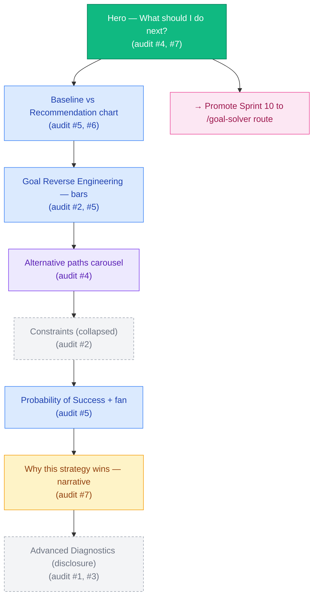
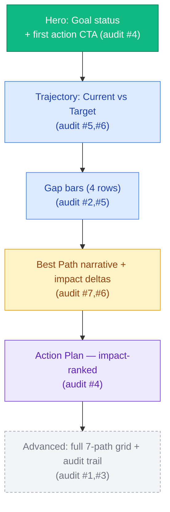
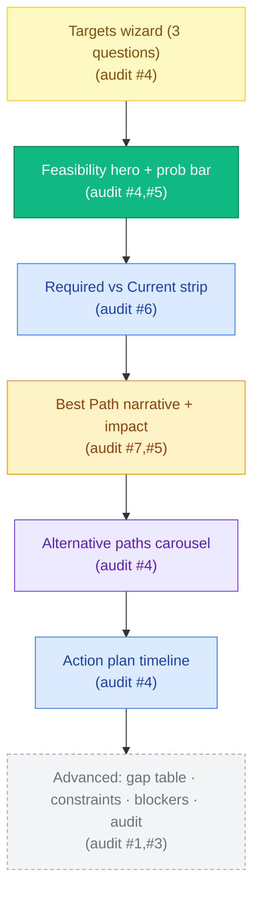
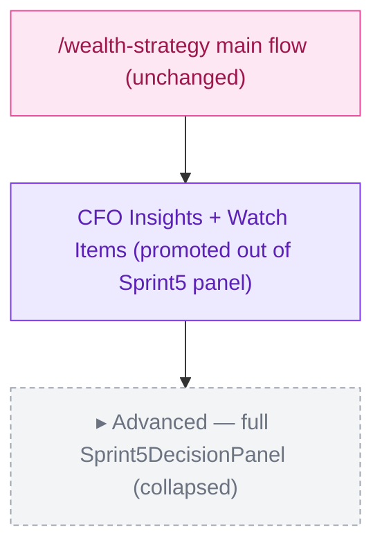
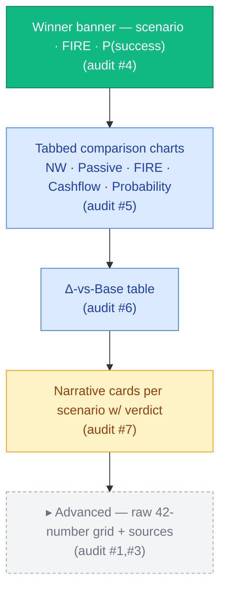
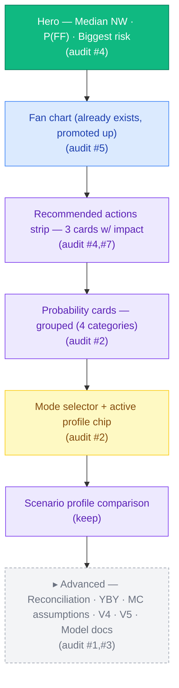

# UX Recovery Sprint — Screen Redesign Proposal

> Module-by-module A–G deliverables.
> A. Current Problems · B. Recommended Layout · C. Fields to Remove · D. Fields to Hide Under Advanced · E. Fields to Promote · F. Charts Required · G. Mock-up Wireframe (Mermaid + ASCII).
> **No code changes — this document drives Sprint 11/12/13.**

Conventions:

- All chart proposals use **recharts** (already imported in `client/src/pages/scenario-compare-v2.tsx`, `client/src/pages/ai-forecast-engine.tsx`, `client/src/pages/fire-path.tsx`).
- Every promoted/recommended field cites an existing engine output — no new calculations are proposed.
- "testid" references match the literal `data-testid` strings in the current code.

---

## Module 1 — Portfolio Lab

### A. Current Problems

(See `01-full-ux-audit-report.md` §Module 1 for full citations.) Headline issues:

- 10 top-level sections in `TruePortfolioOptimizer.tsx` + 14 more in the embedded `PortfolioLab.tsx` + Sprint 8 + Sprint 9 + Sprint 10 — ~30 sections on one page.
- `SearchMetricsCard` (generator capacity, rejection counters) is item #4 — telemetry above the recommendation.
- Two separate Audit Trails (`TruePortfolioOptimizer.tsx:614-668` and `PortfolioLab.tsx:701-794`).
- The actionable recommendation is a 4-cell grid (`featured.actionability.what/when/why/doNothing`) inside the executive card.
- No baseline-vs-recommendation chart anywhere.

### B. Recommended Layout (top → bottom)

1. **Hero — "What should I do next?"** (audit point #4, #7)
   - Single line headline: *"Increase your monthly investment to $X/mo to reach FIRE 3 years sooner."*
   - Three KPI tiles: `Recommended Action` · `Time saved vs do-nothing` · `Probability of success`.
   - Single primary CTA: `Accept · Compare alternatives · Snooze`.
2. **Baseline vs Recommendation comparison strip** (audit point #6)
   - Two-line chart: `Do nothing` (grey) vs `Recommended path` (emerald) — Net Worth over 10 years (data: `forecastEngine.netWorth` for baseline, `pathSimulationEngine` for recommendation).
3. **Goal Reverse Engineering — visual** (audit point #5)
   - Five horizontal "Required vs Current" bars (Net Worth, Passive Income, Asset Base, Monthly Surplus, Monthly Contribution). Replace the 6-cell numeric grid.
4. **Alternative paths** (the 5 `recommendations[]`) as a compact swipeable carousel — only the recommended action + FIRE-year + probability per alt. Drop the 8-cell metric grid per card.
5. **Constraints panel** (already collapsible-friendly, keep as is but collapse closed by default).
6. **Probability of Success** card (`PortfolioLab.tsx:407-446`) — keep, add fan/distribution chart.
7. **Why this strategy wins** (`PortfolioLab.tsx:594-651`) — promote up. This is the page's narrative section.
8. **Advanced Diagnostics** — single collapsed disclosure containing:
   - Scenario Search Engine telemetry
   - Efficient Frontier (table + scatter)
   - Scenario Comparison Matrix
   - Stress Test
   - What Could Cause Failure
   - Confidence Report
   - Audit Trail (both)
9. **Sprint 8 / 9 / 10 panels** — promote Sprint 10 (Goal Solver Pro) to a separate top-level route (`/goal-solver`); leave Sprint 8 + 9 under the Advanced disclosure.

### C. Fields to Remove

- `true-optimizer-search-metrics` entire section (generator/valid/evaluated/frontier/capacity).
- `metrics-reject-*` per-reason rejection counters.
- `true-optimizer-frontier-pareto-count` chip ("17 Pareto-optimal").
- Truncated scenario IDs shown beneath every featured recommendation/frontier row (`true-optimizer-featured-source`, the scenario column in `frontier-row-*`, the first column in `matrix-row-*`).
- `portfolio-lab-strategic-ideas` section (numbers intentionally omitted — move to a separate "Ideas Library" page or delete).
- The duplicated "Audit Trail" on the embedded `PortfolioLab.tsx` (`portfolio-lab-audit-trail`) — there should be one consolidated audit disclosure.
- The `title={metric.source}` HTML tooltip on every metric (engine pointer).

### D. Fields to Hide Under Advanced

Group into a single collapsible "Engine internals" disclosure:

- `true-optimizer-search-metrics` (if not removed entirely, keep behind Advanced).
- `true-optimizer-frontier` (whole section).
- `true-optimizer-matrix` (whole section).
- `true-optimizer-audit-trail` (whole section).
- `portfolio-lab-stress-test`.
- `portfolio-lab-what-could-fail`.
- `portfolio-lab-confidence-report`.
- `portfolio-lab-audit-trail`.
- All `*-not-engine-modelled` / `*-incomplete` badge variants — hide visual treatment by default; expose only inside Advanced.

### E. Fields to Promote to Top

- `true-optimizer-featured-action-what` — should become the **page's first headline string**.
- `featured.actionability.when` — promote to the top KPI tile cluster.
- `gap.shortfall` (current `true-optimizer-gap-solver-shortfall`) — promote into the Hero band.
- `goal-reverse-engineering-summary` (`true-optimizer-goal-reverse-engineering-summary`) — promote as the second paragraph.
- `featured.rationale` — keep just under Hero, larger type.
- `portfolio-lab-why-this-wins-narrative` — promote out of section 11/14 to right under Hero (3rd block).

### F. Charts Required

| # | Chart | Type | Axes | Data source |
|---|---|---|---|---|
| 1 | Baseline vs Recommendation Net Worth | recharts `LineChart` (2 lines + `ReferenceLine` at today) | Year (X) · NW $ (Y) | `forecastEngine.netWorth` (baseline), `pathSimulationEngine` p50 path of the featured recommendation |
| 2 | "Required vs Current" gap bars (5 rows) | recharts `BarChart` horizontal, two bars per row | Metric (Y) · $ or % (X) | `goalReverseEngineering.{requiredNetWorth, requiredPassiveIncome, requiredAssetBase, requiredMonthlySurplus, requiredMonthlyContribution}` paired against the current snapshot values from canonical ledger / `canonicalFire` |
| 3 | FIRE-year sparkline per alt recommendation card | recharts `LineChart` mini | Year (X) · NW (Y) | Sprint 7 `Recommendation.metrics` + Sprint 9 path for that scenario id |
| 4 | Probability of Success fan | recharts `AreaChart` (P10–P90 band, P50 line) | Year (X) · NW (Y) | `pathSimulationEngine.fanChart` for the recommended strategy |
| 5 | Efficient Frontier scatter (inside Advanced) | recharts `ScatterChart` | P(success) (X) · Risk (Y) — color by FIRE year | `truePortfolioOptimizer.frontier.points[*].metrics` |

### G. Mock-up Wireframe



ASCII wireframe — content density and field placement:

```
┌─────────────────────────────────────────────────────────────────────────┐
│ PORTFOLIO LAB ░░░░░░░░░░░░░░░░░░░░░░░░░░░░░░░ Advanced ▾  Help  Privacy │
├─────────────────────────────────────────────────────────────────────────┤
│ ╔═════════════════════════════════════════════════════════════════════╗ │
│ ║  WHAT SHOULD YOU DO NEXT?                              (audit #4,#7)║ │
│ ║  Increase your monthly investment to $4,200/mo                      ║ │
│ ║  → retire 3 years sooner, P(success) = 78%                          ║ │
│ ║                                                                     ║ │
│ ║  [ Recommended action ]  [ Time saved ]  [ Probability ]            ║ │
│ ║       $4,200/mo               -3 yrs           78 %                 ║ │
│ ║                                                                     ║ │
│ ║   [Accept]  [Compare alternatives]  [Snooze 7 days]                 ║ │
│ ╚═════════════════════════════════════════════════════════════════════╝ │
│                                                                         │
│ Baseline vs Recommendation (10-yr NW)                       (audit #6)  │
│ ┌─────────────────────────────────────────────────────────────────────┐ │
│ │  $5M ┤                                          ●─Recommendation    │ │
│ │       │                                  ●──●                       │ │
│ │  $3M ┤                          ●──●                                │ │
│ │       │                   ●──●          ─ ─ ─ ─ ─ ─ Do nothing      │ │
│ │  $1M ┤  ●──●──●──●─                                                 │ │
│ │       └────┬─────┬─────┬─────┬─────┬                                │ │
│ │          2026  2028  2030  2032  2035                               │ │
│ └─────────────────────────────────────────────────────────────────────┘ │
│                                                                         │
│ Goal Reverse Engineering                                    (audit #5)  │
│ ┌─────────────────────────────────────────────────────────────────────┐ │
│ │ Net Worth         current ███▓░░░░░░░░░░░░░░░  required             │ │
│ │ Passive income    current ████▓░░░░░░░░░░░░░░  required             │ │
│ │ Asset base        current ███▓░░░░░░░░░░░░░░░  required             │ │
│ │ Monthly surplus   current ██▓░░░░░░░░░░░░░░░░  required             │ │
│ │ Monthly contrib.  current █▓░░░░░░░░░░░░░░░░░  required             │ │
│ └─────────────────────────────────────────────────────────────────────┘ │
│                                                                         │
│ Alternative paths (4 of 5)                          ◀ swipe ▶          │
│ ┌────────────────┐ ┌────────────────┐ ┌────────────────┐ ┌──────────┐  │
│ │ Fastest FIRE   │ │ Highest P(s)   │ │ Lowest risk    │ │  Stretch │  │
│ │ FIRE 2042      │ │ P 86%          │ │ Risk 28        │ │  +5yr    │  │
│ │ ▁▂▄▇█ spark    │ │ ▁▃▅▇█ spark    │ │ ▁▂▃▄▅ spark    │ │ ▁▂▂▃ ... │  │
│ │ Action: +$5k/m │ │ Action: hybrid │ │ Action: pause  │ │ ...      │  │
│ └────────────────┘ └────────────────┘ └────────────────┘ └──────────┘  │
│                                                                         │
│ ▸ Constraints (collapsed)                                  (audit #2)   │
│                                                                         │
│ Probability of Success                                      (audit #5)  │
│ ┌─────────────────────────────────────────────────────────────────────┐ │
│ │  P10 ░░░░░░░░░░░░░░░░░░░░░░ P50 ████████ P90 ░░░░░░░░░░░░░░░░░░░░░ │ │
│ │  (fan chart)                                                        │ │
│ └─────────────────────────────────────────────────────────────────────┘ │
│                                                                         │
│ Why this strategy wins                                     (audit #7)   │
│ ┌─────────────────────────────────────────────────────────────────────┐ │
│ │ <2-paragraph narrative from portfolio-lab-why-this-wins-narrative>  │ │
│ │ Factors: • lower drawdown · • higher P(success) · • DSR within band │ │
│ └─────────────────────────────────────────────────────────────────────┘ │
│                                                                         │
│ ▸ Advanced diagnostics (collapsed — audit #1, #3)                       │
│   └─ Scenario Search · Efficient Frontier · Matrix · Stress · What     │
│       Could Fail · Confidence Report · Audit Trail · Sprint 5 panel    │
└─────────────────────────────────────────────────────────────────────────┘
```

---

## Module 2 — Goal Closure Lab

### A. Current Problems

- 7-card "Path Comparison" grid renders 56 numbers (`GoalClosureLab.tsx:226-247`).
- Action plan items have no impact magnitude — the user's stated complaint about "+$23 net worth".
- No baseline-vs-recommendation pairing on Goal Status or Best Path.
- 7 gap metrics in one row including derivative ones (asset-base gap ≈ net-worth gap / SWR).
- `Strategic Ideas` and `Audit Trail` are present but add visual weight.

### B. Recommended Layout

1. **Hero — Goal status banner**: `On track / Behind by X years / Ahead by X years` with a primary action button derived from `bestPath.actionable next step` (currently buried inside actionPlan).
2. **Goal Status — trajectory chart** (2 lines: Current Projection vs Target).
3. **Gap Analysis — visual** (4 horizontal bars: Passive Income, Net Worth, Asset Base, Monthly Contribution — drop the 3 constraint chips into a separate "Constraints" sub-row).
4. **Best Path — rich card**: narrative + before/after delta grid + risks (already partially there).
5. **Action Plan — impact-ranked**: re-sort actions by impact (using each action's downstream `delta` on net worth from the engine output). Group by horizon as a secondary tab, not the primary axis. Every action shows an impact tile: `+$X NW · -Y mo to FIRE · ±Z% confidence`.
6. **Advanced disclosure**: Path Comparison (the full 7-card grid), Audit Trail, Strategic Ideas.

### C. Fields to Remove

- `closure-lab-strategic-ideas` (whole section) — same justification as Portfolio Lab.
- `closure-lab-gap-binding` rendered as "Binding Constraint: max-debt" — keep the data, rephrase to `"The binding constraint is your debt ceiling — paying down $X would unlock paths."` and merge into the recommendation narrative.
- `incomplete data` and `Not yet engine-modelled — supporting candidate unavailable.` per-card amber notices — hide visual treatment (data still tracked in DOM for tests).

### D. Fields to Hide Under Advanced

- `closure-lab-audit-trail` (the whole section).
- The full `closure-lab-path-comparison` 7-card grid — replaced in the primary view by a smaller "Top 3 alternative paths" carousel; full grid only inside Advanced.
- The 3 constraint chips in Gap Analysis (`closure-lab-gap-liquidity / -debt / -risk`) — move into Advanced; they are reasons, not gaps.
- The per-metric `title={metric.source}` HTML tooltip — disable by default; expose only with Advanced toggled.

### E. Fields to Promote

- `closure-lab-goal-status-badge` (`statusLabel`) — promote to a banner.
- `bestPath.recommendedLabel` — promote to a Hero button label.
- `bestPath.whyItWins` — promote to a top-section narrative.
- `actionPlan` first item — promote to the Hero CTA itself.
- `closure-lab-goal-years` (years ahead/behind) — promote to a single delta tile in the hero.

### F. Charts Required

| # | Chart | Type | Axes | Data source |
|---|---|---|---|---|
| 1 | Goal Status trajectory | recharts `LineChart` (Current Projection vs Target — `ReferenceLine` at target) | Year (X) · NW (Y) | `goalClosureLab.goalStatus.{currentProjection, target}` plus `forecastEngine.netWorth` series |
| 2 | Gap Analysis horizontal bars | recharts `BarChart` horizontal | Metric (Y) · $ (X) | `gapAnalysis.{passiveIncomeGap, netWorthGap, assetBaseGap, monthlyContributionGap}` |
| 3 | Path comparison spider | recharts `RadarChart` (4–7 axes) | axes = the 8 metrics already shown | `pathComparison[*].metrics` |
| 4 | Best Path expected impact deltas | recharts `BarChart` horizontal (signed bars) | Metric (Y) · delta (X) | `bestPath.expectedImpact` paired against current snapshot values |

### G. Mock-up Wireframe



```
┌─────────────────────────────────────────────────────────────────────────┐
│ GOAL CLOSURE LAB                                  Advanced ▾   Help    │
├─────────────────────────────────────────────────────────────────────────┤
│ ╔═════════════════════════════════════════════════════════════════════╗ │
│ ║  ⚑ You are 2.4 years BEHIND your FIRE target            (audit #4) ║ │
│ ║                                                                     ║ │
│ ║  Best next move: Reallocate $X/mo from cash to ETFs                 ║ │
│ ║  Impact: closes 1.8 of those 2.4 years, P(success) → 71%            ║ │
│ ║                                                                     ║ │
│ ║   [Make this change]  [Compare top 3 paths]                         ║ │
│ ╚═════════════════════════════════════════════════════════════════════╝ │
│                                                                         │
│ Trajectory — Current vs Target                              (audit #5,6)│
│ ┌─────────────────────────────────────────────────────────────────────┐ │
│ │  $4M ┤            ──── target ── ── ── ── ── ── ── ── ── ── ── ──   │ │
│ │       │                                                ●─current    │ │
│ │  $2M ┤                            ●──●──●──●                        │ │
│ │       │             ●──●──●                                         │ │
│ │  $0   └────┬─────┬─────┬─────┬─────┬                                │ │
│ │          2026  2030  2034  2038  2042                               │ │
│ └─────────────────────────────────────────────────────────────────────┘ │
│                                                                         │
│ Gap analysis                                            (audit #2,#5)   │
│ ┌─────────────────────────────────────────────────────────────────────┐ │
│ │ Passive income gap   current ▓▓▓░░░░░░░░░░░░░░░░░ target  $90k/yr   │ │
│ │ Net worth gap        current ▓▓▓▓▓░░░░░░░░░░░░░░ target  $4.0M     │ │
│ │ Asset base gap       current ▓▓▓▓░░░░░░░░░░░░░░░ target  $2.3M     │ │
│ │ Monthly contrib gap  current ▓▓░░░░░░░░░░░░░░░░░ target  $4.2k/mo  │ │
│ └─────────────────────────────────────────────────────────────────────┘ │
│                                                                         │
│ Best path: Hybrid 60/40                                  (audit #7,#6)  │
│ ┌─────────────────────────────────────────────────────────────────────┐ │
│ │ <whyItWins narrative — 1-2 paragraphs>                              │ │
│ │                                                                     ║ │
│ │ Impact vs do-nothing:                                               │ │
│ │   FIRE age   −2.4 yrs ████████ │ NW @2035   +$640k █████            │ │
│ │   Passive    +$11k/yr ██████   │ MC P(succ)  +12pp ███              │ │
│ │ Risks: • higher leverage · • cash drawdown in yr 3                  │ │
│ └─────────────────────────────────────────────────────────────────────┘ │
│                                                                         │
│ Action plan — impact ranked                                 (audit #4)  │
│ ┌─────────────────────────────────────────────────────────────────────┐ │
│ │ #1  Reallocate $X/mo cash→ETF        +$Y NW · −1.4 yr to FIRE  [↗] │ │
│ │ #2  Refinance loan rate −0.3%        +$Y NW · −0.5 yr          [↗] │ │
│ │ #3  Add IP in 2027                   +$Y NW · −0.2 yr · ⚠ risk [↗] │ │
│ │ ... (collapsible)                                                   │ │
│ │ [Tabs:  By impact  |  By horizon (this mo / 3 mo / 12 mo / major)] │ │
│ └─────────────────────────────────────────────────────────────────────┘ │
│                                                                         │
│ ▸ Advanced — 7-path comparison · audit trail · strategic ideas         │
└─────────────────────────────────────────────────────────────────────────┘
```

---

## Module 3a — Decision Engine (Goal Solver Pro)

### A. Current Problems

- The 11-field targets form is intimidating (`GoalSolverProSection.tsx:133-145`).
- 8-field audit trail per entry (most provenance-heavy).
- Required Inputs card has no "Current" column.
- Alternative Paths card shows raw `score` numbers.
- Action plan has source metadata exposed.
- **Critically: not mounted on `/decision` route** — only reachable inside `/portfolio-lab` (executive item #9).

### B. Recommended Layout

1. **Re-route** — mount `GoalSolverProSection` on `/decision` (or a new `/goal-solver`) so the "Decision Engine" the user sees is actually Sprint 10. The current `/decision` page (which embeds `ScenarioCompareV2Page` in an "Advanced" tab) should keep that tab but the primary tab should be Goal Solver Pro.
2. **Targets form — guided wizard** — collapse from 11 fields to a 3-question wizard:
   - "By when do you want financial freedom?" → `targetFireYear`
   - "How much passive income do you need?" → `targetPassiveIncomeAnnual`
   - "Any constraints?" (optional reveal) → property count / debt ceiling / risk limit
3. **Feasibility hero** — big status (ACHIEVABLE / STRETCH / UNLIKELY / IMPOSSIBLE) + 4 numbers + probability bar.
4. **Required-vs-Current** comparison strip — replace Required Inputs card with two-column delta layout.
5. **Best Path narrative + impact** — promote `bestPath.label` and the impact delta chart.
6. **Alternative paths** as a 4-card carousel (Fastest / Highest P / Lowest risk / Hybrid) — drop the `score` numeric.
7. **Action plan** — year-stamped timeline, no source/field leak.
8. **Advanced**: Constraints checks, Blockers, Gap Analysis full table, Audit Trail.

### C. Fields to Remove

- `goal-solver-constraint-evaluated` / `goal-solver-constraint-passing` counters (`GoalSolverProSection.tsx:292-297`).
- `score: {alt.score.toFixed(2)}` line in each Alternative Path card (`:387-389`).
- `source: {a.sourceStrategyId} · field: {a.inputField}` line under each action plan row (`:416-418`).
- Constraint chip labels using slug form (`max-debt: PASS (180000)`) — rephrase to human form.

### D. Fields to Hide Under Advanced

- `goal-solver-audit-trail` entire section.
- `goal-solver-constraints` (the chip wall) — moves into Advanced as a checklist.
- `goal-solver-blockers` — keep visible only when status === IMPOSSIBLE; otherwise hide.
- The full `goal-solver-gap-analysis` table (keep its content but render the top 3 gaps as bars in the primary view; full table → Advanced).
- 8 of the 11 target fields — keep only `targetFireYear`, `targetPassiveIncomeAnnual`, `targetPropertyCount` primary; the other 8 inside "Add a constraint" disclosure.

### E. Fields to Promote

- `goal-solver-feasibility-status` (the chip) → hero status banner.
- `goal-solver-feasibility-prob` → primary KPI tile.
- `goal-solver-best-path-label` → page H1 verb form ("Recommended: Hybrid 60/40").
- `goal-solver-best-path-nw` (with "P50" relabelled "median outcome").
- `requiredMonthlyDCA` → with a "currently $X, increase by $Y" delta.
- First `actionPlan` item → CTA.

### F. Charts Required

| # | Chart | Type | Axes | Data source |
|---|---|---|---|---|
| 1 | Feasibility probability bar | recharts horizontal `BarChart` (single bar, 0–100 % with status colour) | % (X) | `feasibility.probabilityOfSuccess` |
| 2 | FIRE year fan | recharts mini area | Best/Median/Worst markers | `feasibility.{bestCaseFireYear, medianFireYear, worstCaseFireYear}` |
| 3 | Required vs Current strip (5 rows) | recharts horizontal `BarChart` (two bars per row) | $ (X) | `requiredInputs.*` + matching canonical-ledger current values |
| 4 | Alternative-paths score-vs-FIRE-year compare | recharts `ScatterChart` (4 dots) | FIRE year (X) · Probability (Y) | `alternativePaths[*].path.{medianFireYear, probabilityFireByTarget}` |
| 5 | Action plan timeline | recharts `BarChart` or simple SVG timeline | Year (X) | `actionPlan[*].year` + per-action impact (engine `actionImpact`) |

### G. Mock-up Wireframe



```
┌─────────────────────────────────────────────────────────────────────────┐
│ DECISION ENGINE — Goal Solver                       Advanced ▾   Help  │
├─────────────────────────────────────────────────────────────────────────┤
│ Targets                                                     (audit #4)  │
│ ┌─────────────────────────────────────────────────────────────────────┐ │
│ │ 1. When do you want financial freedom?    [ 2045 ▾ ]                │ │
│ │ 2. How much passive income / yr?          [ $90,000 ]               │ │
│ │ 3. Constraints (optional ▾)                                         │ │
│ │    ↳ max properties [  ]  max debt [  ]  risk limit [  ]  …         │ │
│ └─────────────────────────────────────────────────────────────────────┘ │
│                                                                         │
│ ╔═════════════════════════════════════════════════════════════════════╗ │
│ ║  ◉ STRETCH      P(success) 64%             (audit #4)               ║ │
│ ║  Median FIRE 2046 · best 2043 · worst 2052                          ║ │
│ ║  ▓▓▓▓▓▓▓▓▓▓▓▓▓░░░░░░░ 64% probability bar                           ║ │
│ ╚═════════════════════════════════════════════════════════════════════╝ │
│                                                                         │
│ Required vs Current                                         (audit #6)  │
│ ┌─────────────────────────────────────────────────────────────────────┐ │
│ │ Monthly DCA          current $2.1k ░░░░ │████ required $4.2k (+$2.1k)│ │
│ │ Additional capital   current $0    ░░░░░│██░  required $35k          │ │
│ │ Properties           current 2     ░░░░░│░░   required 2 (no change) │ │
│ │ Savings rate         current 22%   ░░░░░│██   required 31%           │ │
│ │ FIRE number          current $1.8M ░░░░░│███▓ required $2.25M        │ │
│ └─────────────────────────────────────────────────────────────────────┘ │
│                                                                         │
│ Best path: Hybrid 60/40                                     (audit #7)  │
│ ┌─────────────────────────────────────────────────────────────────────┐ │
│ │ <whyItWins narrative>                                               │ │
│ │ Impact:  FIRE −2.4 yrs · NW +$640k · P +12pp                        │ │
│ └─────────────────────────────────────────────────────────────────────┘ │
│                                                                         │
│ Alternative paths                                  ◀ swipe ▶ (audit #4) │
│ ┌──────────────┐ ┌──────────────┐ ┌──────────────┐ ┌──────────────────┐│
│ │ Fastest FIRE │ │ Highest P    │ │ Lowest risk  │ │  Hybrid (best)  ⭐││
│ │ FIRE 2043    │ │ P 78%        │ │ Risk 28      │ │  FIRE 2045 · 71%││
│ └──────────────┘ └──────────────┘ └──────────────┘ └──────────────────┘│
│                                                                         │
│ Action plan timeline                                        (audit #4)  │
│ ┌─────────────────────────────────────────────────────────────────────┐ │
│ │ 2026 ━━ Increase DCA to $4.2k/mo            +$Y NW · 1.4 yr saved   │ │
│ │ 2027 ━━━━ Add IP                             +$Y NW · 0.5 yr saved  │ │
│ │ 2030 ━━━━━━ Refinance to ETF-heavy mix      +$Y NW · 0.2 yr saved   │ │
│ └─────────────────────────────────────────────────────────────────────┘ │
│                                                                         │
│ ▸ Advanced — gap table · constraints · blockers · audit trail          │
└─────────────────────────────────────────────────────────────────────────┘
```

---

## Module 3b — Decision Engine internals (S5/S6)

### A. Current Problems

`decisionCandidates.ts` / `decisionRanking.ts` are S5/S6 building blocks consumed by Sprint 7+. Their UI consumer is `Sprint5DecisionPanel` mounted only on `/wealth-strategy`. The panel duplicates:

- Yet another "scenario comparison" table (`sprint5-scenario-comparison-table`).
- Yet another ranking table with raw composite scores and breakdown bars.
- Yet another best-move card with rationale.
- CFO advisor insight list + watch items list.

### B. Recommended Layout

These should not be a stand-alone product surface. The user-facing "Decision Engine" is Module 3a. Recommendation:

- Hide the entire `Sprint5DecisionPanel` on `/wealth-strategy` behind an "Engine internals" disclosure.
- Strip the duplicated scenario-comparison table — link to Module 4 instead.
- Strip the duplicated ranking — link to Module 1 / Module 3a.
- Keep only **CFO insights + Watch items** as user-facing content; they are unique to this surface.

### C. Fields to Remove

- `sprint5-scenario-comparison-table` (entire table).
- `sprint5-top3-row-{rank}-score` numeric values.
- `sprint5-top3-row-{rank}-breakdown` bar visualisation (technical).

### D. Fields to Hide Under Advanced

- The entire `Sprint5DecisionPanel` becomes an Advanced disclosure on `/wealth-strategy`.
- CFO insights + Watch items can remain in the primary Wealth Strategy view, just outside the panel.

### E. Fields to Promote

- CFO insights (`sprint5-cfo-insights`) and Watch items — promote out of the Sprint5 panel into a standalone "Watch list" card on Wealth Strategy.

### F. Charts Required

None additional. These internals do not need new charts.

### G. Mock-up Wireframe



```
┌──────────────────────────────────────────────────────────────────────┐
│ /wealth-strategy                                                    │
│  ... existing Wealth Strategy content unchanged ...                │
│                                                                      │
│ Watch list                                                          │
│ ┌──────────────────────────────────────────────────────────────────┐ │
│ │ • Cash buffer below 1 month — review next 30 days                │ │
│ │ • LVR drift over 80% projected 2027                              │ │
│ │ ...                                                              │ │
│ └──────────────────────────────────────────────────────────────────┘ │
│                                                                      │
│ ▸ Engine internals (S5/S6 ranking, scenario candidates, audit)      │
└──────────────────────────────────────────────────────────────────────┘
```

---

## Module 4 — Scenario Compare

> **Two surfaces to be unified.** The good-UX `ScenarioCompareV2Page` (`client/src/pages/scenario-compare-v2.tsx`) already does most of what the user wants. The problematic `ScenarioCompareWorkspace.tsx` is what the user is complaining about.

### A. Current Problems

(See `01-full-ux-audit-report.md` §Module 4A.) Key issues with `ScenarioCompareWorkspace.tsx`:

- 42-number grid, zero charts.
- No Δ-vs-Base column.
- `recommendedAction` rendered as a `ScenarioMetric` value not a callout.
- Empty-state shows raw `"no-ledger"` monospace string.
- No "Passive income" or "FIRE year" chart comparison (user explicitly asked for these).
- No "Probability" comparison visual.

### B. Recommended Layout

**Plan A (preferred):** redirect `/scenario-compare-workspace` to `ScenarioCompareV2Page` and deprecate `ScenarioCompareWorkspace.tsx`. The V2 page already shows Net Worth fan, Liquidity fan, Δ vs Base chart, MC Bands chart, narrative cards with verdict chips, and a comparison table.

**Plan B (if backwards compat is needed):** keep `ScenarioCompareWorkspace` but reshape it to mirror V2's design:

1. **Winner banner** — bold "Best scenario: X · expected FIRE 2042 · P 78%" at top.
2. **Side-by-side multi-metric chart** — five tabbed line charts (Net Worth · Passive Income · FIRE Year · Cashflow · Probability) — these are the five comparisons the user explicitly asked for.
3. **Δ-vs-Base comparison table** — every metric shown as a signed delta against base.
4. **Narrative card per scenario** with verdict chip + "Why / What could go wrong" two-up.

### C. Fields to Remove

- `scenario-compare-workspace-empty-reason` (monospace `"no-ledger"` rendering at `:290-295`).
- Per-card `title={metric.source}` HTML tooltip leak.
- `Recommended Action` rendered as a `ScenarioMetric` — replace with a proper CTA banner.

### D. Fields to Hide Under Advanced

- The `data-recommended` and `data-scenario-id` attributes have no user impact; keep for tests.
- The duplicate side-by-side card grid below the table (`:343-350`) — remove or collapse.

### E. Fields to Promote

- The winner scenario id + its FIRE year + its probability — should be the page hero.
- The base-vs-winner Δ on each of the 5 user-listed metrics → KPI strip.
- The per-scenario `definition.description` → narrative tile.

### F. Charts Required

The user's exact ask was: instantly compare **Net worth · Passive income · FIRE year · Cashflow · Probability** between scenarios.

| # | Chart | Type | Axes | Data source |
|---|---|---|---|---|
| 1 | Net Worth comparison | recharts `LineChart` (1 line per scenario) | Year (X) · NW (Y) | `scenarioCompareWorkspace.rows[*].metrics.netWorth` (trajectory) — engine already returns trajectory for V2 page (`scenarioCompareV2` results) |
| 2 | Passive Income comparison | recharts `LineChart` | Year (X) · $/yr (Y) | `rows[*].metrics.passiveIncome` |
| 3 | FIRE Year comparison | recharts horizontal `BarChart` (1 row per scenario) | Year (X) | `rows[*].metrics.fireDate` |
| 4 | Cashflow comparison | recharts `LineChart` | Year (X) · $/mo (Y) | `rows[*].metrics.monthlySurplus` (trajectory) |
| 5 | Probability comparison | recharts `BarChart` vertical (1 bar per scenario, 0-100%) | Scenario (X) · % (Y) | `rows[*].metrics.monteCarloConfidence` |
| 6 | Δ-vs-Base radar (optional) | recharts `RadarChart` | 5 axes = user's 5 metrics | engine deltas vs base |

### G. Mock-up Wireframe



```
┌─────────────────────────────────────────────────────────────────────────┐
│ SCENARIO COMPARE                                  Advanced ▾   Help    │
├─────────────────────────────────────────────────────────────────────────┤
│ ╔═════════════════════════════════════════════════════════════════════╗ │
│ ║  ⭐ Best for you: Hybrid 60/40                          (audit #4) ║ │
│ ║  FIRE 2042 (vs 2046 Base · -4 yrs) · P(success) 78% (+18pp)        ║ │
│ ╚═════════════════════════════════════════════════════════════════════╝ │
│                                                                         │
│ Compare scenarios on:                                       (audit #5)  │
│ [ Net Worth  |  Passive Income  |  FIRE Year  |  Cashflow  |  Prob ]   │
│ ┌─────────────────────────────────────────────────────────────────────┐ │
│ │  $5M ┤                                            ●─Hybrid (best)  │ │
│ │       │                                    ●──●                    │ │
│ │  $3M ┤                          ●──●  ─●─Property                  │ │
│ │       │                   ●──●                                     │ │
│ │  $1M ┤  ●──●──●──●──●─                                             │ │
│ │       │                                ─ ─ ─ Base                  │ │
│ │       └────┬─────┬─────┬─────┬─────┬                               │ │
│ │          2026  2030  2034  2038  2042                              │ │
│ └─────────────────────────────────────────────────────────────────────┘ │
│                                                                         │
│ Δ vs Base table                                             (audit #6)  │
│ ┌──────────────┬──────────┬──────────┬──────────┬──────────┬──────────┐│
│ │              │   NW     │ Passive  │  FIRE    │ Cashflow │  Prob   ││
│ ├──────────────┼──────────┼──────────┼──────────┼──────────┼──────────┤│
│ │ Base         │   ─      │   ─      │   ─      │   ─      │   ─     ││
│ │ Property     │  +$220k  │  +$3k/yr │ −1.2 yr  │ −$0.4k/m │ +6pp    ││
│ │ Crypto       │  +$95k   │  +$1k/yr │ −0.4 yr  │ −$0.1k/m │ −2pp    ││
│ │ Cash         │  −$60k   │  −$2k/yr │ +1.1 yr  │ +$0.3k/m │ −9pp    ││
│ │ Hybrid (⭐)  │  +$640k  │  +$11k/yr│ −4.0 yr  │ +$0.6k/m │ +18pp   ││
│ └──────────────┴──────────┴──────────┴──────────┴──────────┴──────────┘│
│                                                                         │
│ Narrative cards                                            (audit #7)   │
│ ┌──────────────────────────┐ ┌──────────────────────────┐               │
│ │ Hybrid (BEST)            │ │ Property                  │              │
│ │ Verdict: STRONG          │ │ Verdict: VIABLE           │              │
│ │ Story: ...               │ │ Story: ...                │              │
│ │ Why it works · Risk      │ │ Why · Risk                │              │
│ └──────────────────────────┘ └──────────────────────────┘               │
│                                                                         │
│ ▸ Advanced — raw 42-number grid · engine sources · audit                │
└─────────────────────────────────────────────────────────────────────────┘
```

---

## Module 5 — Forecast Engine

### A. Current Problems

- Source-of-Truth Reconciliation card is a 12-field engineering reconciliation report (`ai-forecast-engine.tsx:949-994`).
- "Drift detected" badge exposes engine state to user.
- 12 Probability cards in a flat 4-column grid.
- Mode card explainers, Year-by-Year table, Expected Returns, MC Assumptions, "Assumptions used by this simulation", V4 panel, V5 panel — too many parallel surfaces.
- Recommended Actions and Key Risks are co-equal — no primary CTA.

### B. Recommended Layout

1. **Hero — "Where do you land in 10 years?"** with three big tiles: Median NW · P(financial freedom) · Biggest risk.
2. **Fan chart (existing)** — bring up to second slot.
3. **Recommended actions promoted into a strip** (3 horizontal action cards with quick CTAs).
4. **Probability cards regrouped into 4 categories** (Outcome / Wealth thresholds / Cashflow risk / Time):
   - Outcome: Median NW, P(FF), Highest risk year
   - Wealth thresholds: P($3M), P($5M), P($10M)
   - Cashflow risk: P(negCF), P(cashShortfall), Median lowest cash
   - Time: Biggest risk driver (move from a tile to a callout)
5. **Mode selector** (Simple / MC / Year-by-Year) — keep prominent but moved below hero, with a "?" tooltip explaining each.
6. **Scenario comparison of profiles** (conservative/moderate/aggressive) — keep as is.
7. **Advanced disclosure** containing:
   - Source-of-Truth Reconciliation
   - Year-by-Year assumptions table
   - Expected Returns
   - MC Assumptions
   - "Assumptions used by this simulation"
   - V4 Institutional Terminal panel
   - V5 Realism + Advisor panel
   - Model Assumptions Explained accordion

### C. Fields to Remove

- The "Drift detected" badge — should never be user-visible. If drift occurs, engineering should be alerted, not the user.
- `traceId` outline indicators on every `ProbCard` (visual artefact from `AuditableMetric` wrapper) — invisible-by-default; opt-in via Audit Mode.
- `highest_risk_year` and `biggest_risk_driver` ProbCards as standalone tiles — fold into the Recommended Actions narrative.

### D. Fields to Hide Under Advanced

- Entire Source-of-Truth Reconciliation card (12 fields).
- Year-by-Year Assumptions table (most users will never edit).
- Expected Returns block.
- Monte Carlo Assumptions block.
- "Assumptions used by this simulation" block.
- V4 Institutional Wealth Terminal panel.
- V5 Realism + Advisor Intelligence panel.

### E. Fields to Promote

- `mc.median`, `mc.prob_ff`, `mc.biggest_risk_driver` → three hero tiles.
- Fan chart → second slot (was 7th).
- `mc.recommended_actions[0]` → primary action CTA.
- Forecast Mode selector with one-line "use this when…" copy.

### F. Charts Required

Most charts exist already; gaps to fill:

| # | Chart | Type | Axes | Data source |
|---|---|---|---|---|
| 1 | Mini distribution under each ProbCard | recharts `BarChart` mini sparkline (3 bars: P10/P50/P90) | Percentile (X) · NW (Y) | Each `ProbCard`'s underlying P10/P50/P90 values from `mc` |
| 2 | Recommended-actions impact strip | recharts horizontal `BarChart` (3 rows) | Δ NW (X) per action | Engine `mc.recommended_actions` with impact field (if engine exposes; otherwise drop the magnitude) |
| 3 | Existing fan chart | (keep) | Year × NW | `mc.fan_data` |

### G. Mock-up Wireframe



```
┌─────────────────────────────────────────────────────────────────────────┐
│ AI FORECAST ENGINE                              Advanced ▾   Help      │
├─────────────────────────────────────────────────────────────────────────┤
│ ╔═════════════════════════════════════════════════════════════════════╗ │
│ ║  Where will you be in 2035?                            (audit #4)  ║ │
│ ║   $4.1M median NW · 78 % chance of $120k/yr passive                 ║ │
│ ║   Biggest risk: property-vacancy in 2030                            ║ │
│ ╚═════════════════════════════════════════════════════════════════════╝ │
│                                                                         │
│ Net worth fan chart 2026–2035                              (audit #5)   │
│ ┌─────────────────────────────────────────────────────────────────────┐ │
│ │  $6M ┤  ░░░░░░░░░░░░░░░░░░░░░░░░░░░ P90                            │ │
│ │       │  ▒▒▒▒▒▒▒▒▒▒▒▒▒▒▒▒▒▒▒▒▒▒▒▒▒▒ P75                            │ │
│ │  $3M ┤  ▓▓▓▓▓▓▓▓▓▓▓▓▓▓▓▓▓▓▓▓▓▓▓▓▓▓ Median                          │ │
│ │       │  ▒▒▒▒▒▒▒▒▒▒▒▒▒▒▒▒▒▒▒▒▒▒▒▒▒▒ P25                            │ │
│ │  $1M ┤  ░░░░░░░░░░░░░░░░░░░░░░░░░░░ P10                            │ │
│ │       └────┬─────┬─────┬─────┬─────┬                               │ │
│ │          2026  2028  2030  2032  2035                              │ │
│ └─────────────────────────────────────────────────────────────────────┘ │
│                                                                         │
│ Recommended actions                                        (audit #4,7) │
│ ┌─────────────────┐ ┌─────────────────┐ ┌─────────────────┐            │
│ │ Build cash buf  │ │ Reduce LVR <70% │ │ Diversify ETF   │            │
│ │ +6mo runway     │ │ −4% def risk    │ │ +3pp prob_FF    │            │
│ │ [Mark done]     │ │ [Mark done]     │ │ [Mark done]     │            │
│ └─────────────────┘ └─────────────────┘ └─────────────────┘            │
│                                                                         │
│ Probability outcomes              (re-grouped — audit #2)               │
│ Outcome:     Median NW $4.1M · P(FF) 78% · Risk year 2030               │
│ Wealth:      P($3M) 92% · P($5M) 46% · P($10M) 6%                       │
│ Cashflow:    P(negCF) 18% · P(cashShort) 22% · Median min $58k          │
│                                                                         │
│ Forecast mode      ◉ Monte Carlo (recommended)                          │
│  ○ Simple Forecast    ○ Year-by-Year                                    │
│                                                                         │
│ Scenario profile comparison (Conservative / Moderate / Aggressive)      │
│                                                                         │
│ ▸ Advanced — reconciliation · YBY · MC assumptions · V4 · V5 · docs    │
└─────────────────────────────────────────────────────────────────────────┘
```

---

## Cross-module mapping summary

| Module | # sections today | # primary sections after | Charts added | Audit-trail visibility |
|---|---|---|---|---|
| Portfolio Lab | ~30 | 8 + 1 Advanced disclosure | 5 | All audit moved into Advanced |
| Goal Closure Lab | 7 | 5 + 1 Advanced | 4 | Moved into Advanced |
| Decision Engine (Goal Solver Pro) | 9 + targets form (11 fields) | 6 + 1 Advanced + 3-question wizard | 5 | Moved into Advanced |
| Decision Engine internals | 1 standalone panel | Collapsed-by-default disclosure on /wealth-strategy | — | — |
| Scenario Compare (workspace) | 1 grid | 4 sections (winner / tabbed chart / Δ-table / narratives) | 5 | Moved into Advanced |
| Forecast Engine | 10 | 6 + 1 Advanced (covering 5 dev surfaces) | 1 new (mini sparks) + reorder | Moved into Advanced |

See `03-wireframes.md` for the standalone wireframe sheet and `04-priority-ranked-implementation-plan.md` for the sprint-by-sprint sequencing.
