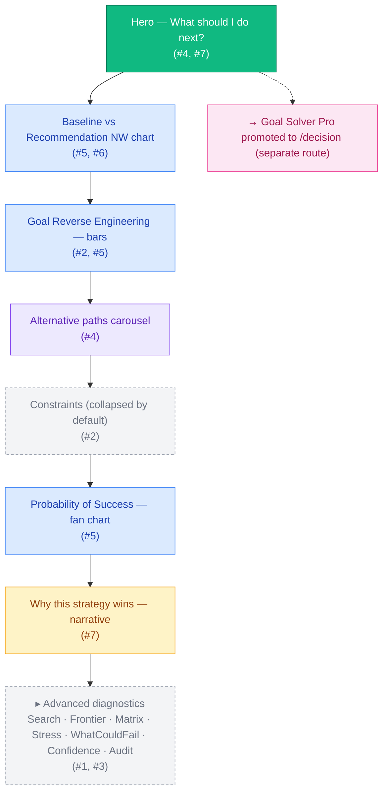
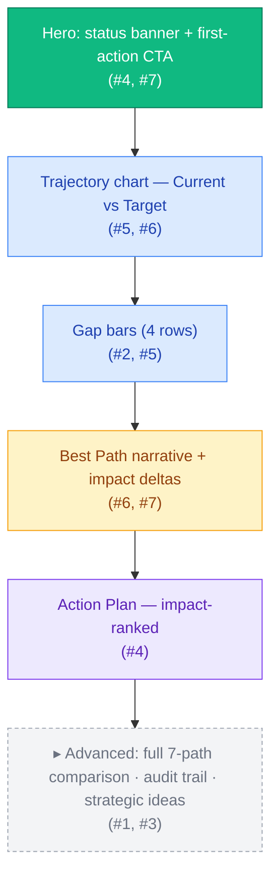
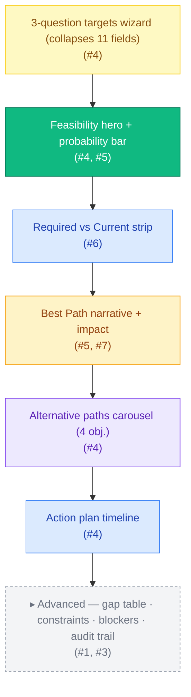
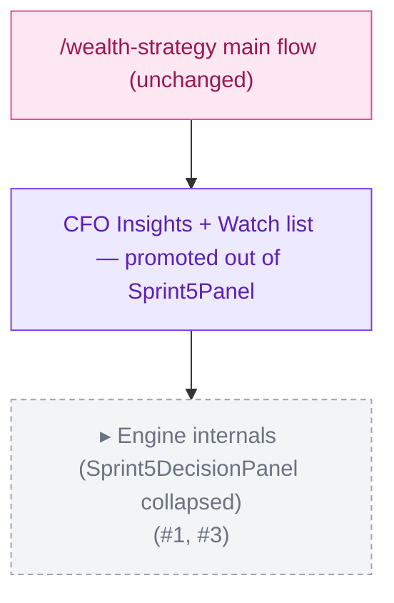
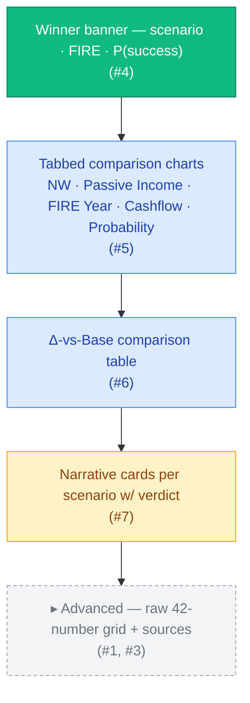
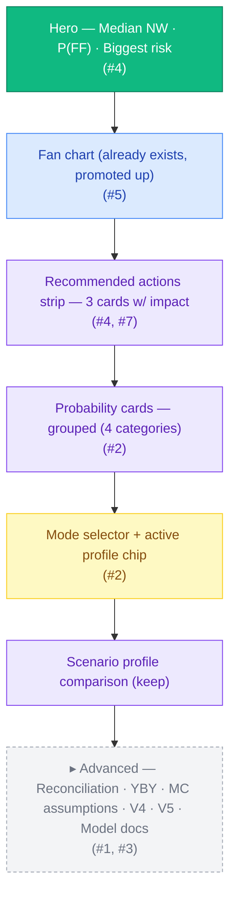

# UX Recovery Sprint — Wireframes

> Standalone wireframe sheet — one Mermaid block-diagram + one ASCII content wireframe per redesigned screen.
> Cross-references back to `02-screen-redesign-proposal.md` for full A–G context.
> Audit-point annotations on every region: (#1) useless info · (#2) noise · (#3) diagnostic-hide · (#4) missing decision · (#5) missing chart · (#6) missing baseline · (#7) missing narrative.

---

## Index

| # | Screen | Route | Cross-link |
|---|---|---|---|
| 1 | Portfolio Lab | `/portfolio-lab` | proposal §Module 1 |
| 2 | Goal Closure Lab | `/goal-closure-lab` | proposal §Module 2 |
| 3 | Decision Engine — Goal Solver | `/decision` (new) | proposal §Module 3a |
| 4 | Decision Engine internals | `/wealth-strategy` (Advanced disclosure) | proposal §Module 3b |
| 5 | Scenario Compare | `/scenario-compare` | proposal §Module 4 |
| 6 | AI Forecast Engine | `/ai-forecast-engine` | proposal §Module 5 |

---

## 1 — Portfolio Lab

### 1a. Layout block diagram



### 1b. Content wireframe

```
┌─────────────────────────────────────────────────────────────────────────┐
│ PORTFOLIO LAB                            ░░░░ Advanced ▾  Help  Privacy │
├─────────────────────────────────────────────────────────────────────────┤
│ ╔═════════════════════════════════════════════════════════════════════╗ │
│ ║  WHAT SHOULD YOU DO NEXT?                              (#4, #7)    ║ │
│ ║  Increase your monthly investment to $4,200/mo                      ║ │
│ ║  → retire 3 years sooner, P(success) = 78%                          ║ │
│ ║                                                                     ║ │
│ ║  [Recommended action]  [Time saved]  [Probability]                  ║ │
│ ║       $4,200/mo            -3 yrs        78 %                       ║ │
│ ║                                                                     ║ │
│ ║   [Accept]  [Compare alternatives]  [Snooze 7 days]                 ║ │
│ ╚═════════════════════════════════════════════════════════════════════╝ │
│                                                                         │
│ Baseline vs Recommendation (10-yr NW)                          (#6)    │
│ ┌─────────────────────────────────────────────────────────────────────┐ │
│ │  $5M ┤                                          ●─Recommendation    │ │
│ │       │                                  ●──●                       │ │
│ │  $3M ┤                          ●──●                                │ │
│ │       │                   ●──●          ─ ─ ─ ─ ─ ─ Do nothing      │ │
│ │  $1M ┤  ●──●──●──●─                                                 │ │
│ │       └────┬─────┬─────┬─────┬─────┬                                │ │
│ │          2026  2028  2030  2032  2035                               │ │
│ └─────────────────────────────────────────────────────────────────────┘ │
│                                                                         │
│ Goal Reverse Engineering                                       (#5)    │
│ ┌─────────────────────────────────────────────────────────────────────┐ │
│ │ Net Worth         ░░░░░░░░░░░░░░░░░░░░░░░░░░ current vs required   │ │
│ │ Passive income    ░░░░░░░░░░░░░░░░░░░░░░░░░░                       │ │
│ │ Asset base        ░░░░░░░░░░░░░░░░░░░░░░░░░░                       │ │
│ │ Monthly surplus   ░░░░░░░░░░░░░░░░░░░░░░░░░░                       │ │
│ │ Monthly contrib   ░░░░░░░░░░░░░░░░░░░░░░░░░░                       │ │
│ └─────────────────────────────────────────────────────────────────────┘ │
│                                                                         │
│ Alternative paths (4 of 5)                          ◀ swipe ▶ (#4)    │
│ ┌──────────┐ ┌──────────┐ ┌──────────┐ ┌──────────┐                    │
│ │ Fastest  │ │ HighP    │ │ Lowrisk  │ │ Stretch  │                    │
│ │ 2042     │ │ 86%      │ │ R 28     │ │ +5yr     │                    │
│ │ ▁▂▄▇█    │ │ ▁▃▅▇█    │ │ ▁▂▃▄▅    │ │ ▁▂▂▃     │                    │
│ │ Action:  │ │ Action:  │ │ Action:  │ │ Action:  │                    │
│ └──────────┘ └──────────┘ └──────────┘ └──────────┘                    │
│                                                                         │
│ ▸ Constraints (collapsed)                                       (#2)   │
│                                                                         │
│ Probability of Success                                         (#5)    │
│ ┌─────────────────────────────────────────────────────────────────────┐ │
│ │  ░░░░░░░░░░ P10           ████ P50           ░░░░░░░░░░ P90        │ │
│ │  (fan area chart over time)                                         │ │
│ └─────────────────────────────────────────────────────────────────────┘ │
│                                                                         │
│ Why this strategy wins                                         (#7)    │
│ ┌─────────────────────────────────────────────────────────────────────┐ │
│ │ <2-paragraph narrative from portfolio-lab-why-this-wins-narrative>  │ │
│ │ Factors: • lower drawdown · • higher P(success) · • DSR within band │ │
│ └─────────────────────────────────────────────────────────────────────┘ │
│                                                                         │
│ ▸ Advanced — Scenario Search · Efficient Frontier · Matrix · Stress    │
│   · What Could Fail · Confidence Report · Audit Trail        (#1,#3)   │
└─────────────────────────────────────────────────────────────────────────┘
```

---

## 2 — Goal Closure Lab

### 2a. Layout block diagram



### 2b. Content wireframe

```
┌─────────────────────────────────────────────────────────────────────────┐
│ GOAL CLOSURE LAB                                  Advanced ▾   Help    │
├─────────────────────────────────────────────────────────────────────────┤
│ ╔═════════════════════════════════════════════════════════════════════╗ │
│ ║  ⚑ You are 2.4 years BEHIND your FIRE target               (#4)    ║ │
│ ║                                                                     ║ │
│ ║  Best next move: Reallocate $X/mo from cash to ETFs                 ║ │
│ ║  Impact: closes 1.8 of those 2.4 years, P(success) → 71%            ║ │
│ ║                                                                     ║ │
│ ║   [Make this change]  [Compare top 3 paths]                         ║ │
│ ╚═════════════════════════════════════════════════════════════════════╝ │
│                                                                         │
│ Trajectory — Current vs Target                                 (#5,#6) │
│ ┌─────────────────────────────────────────────────────────────────────┐ │
│ │  $4M ┤            ──── target line ── ── ── ── ── ── ── ── ──       │ │
│ │       │                                                ●─current    │ │
│ │  $2M ┤                            ●──●──●──●                        │ │
│ │       │             ●──●──●                                         │ │
│ │  $0   └────┬─────┬─────┬─────┬─────┬                                │ │
│ │          2026  2030  2034  2038  2042                               │ │
│ └─────────────────────────────────────────────────────────────────────┘ │
│                                                                         │
│ Gap analysis                                                  (#2,#5)  │
│ ┌─────────────────────────────────────────────────────────────────────┐ │
│ │ Passive income gap   current ▓▓▓░░░░░░░░░░░░░░░░░ target $90k/yr   │ │
│ │ Net worth gap        current ▓▓▓▓▓░░░░░░░░░░░░░░ target $4.0M      │ │
│ │ Asset base gap       current ▓▓▓▓░░░░░░░░░░░░░░░ target $2.3M      │ │
│ │ Monthly contrib gap  current ▓▓░░░░░░░░░░░░░░░░░ target $4.2k/mo   │ │
│ └─────────────────────────────────────────────────────────────────────┘ │
│                                                                         │
│ Best path: Hybrid 60/40                                       (#6,#7)  │
│ ┌─────────────────────────────────────────────────────────────────────┐ │
│ │ <whyItWins narrative — 1-2 paragraphs>                              │ │
│ │                                                                     │ │
│ │ Impact vs do-nothing:                                               │ │
│ │   FIRE age   −2.4 yrs ████████ │ NW @2035   +$640k █████            │ │
│ │   Passive    +$11k/yr ██████   │ MC P(succ)  +12pp ███              │ │
│ │ Risks: • higher leverage · • cash drawdown in yr 3                  │ │
│ └─────────────────────────────────────────────────────────────────────┘ │
│                                                                         │
│ Action plan — impact ranked                                    (#4)    │
│ ┌─────────────────────────────────────────────────────────────────────┐ │
│ │ #1  Reallocate $X/mo cash→ETF        +$Y NW · −1.4 yr to FIRE  [↗] │ │
│ │ #2  Refinance loan rate −0.3%        +$Y NW · −0.5 yr          [↗] │ │
│ │ #3  Add IP in 2027                   +$Y NW · −0.2 yr · ⚠ risk [↗] │ │
│ │ [Tabs:  By impact  |  By horizon (this mo / 3 mo / 12 mo / major)] │ │
│ └─────────────────────────────────────────────────────────────────────┘ │
│                                                                         │
│ ▸ Advanced — 7-path comparison · audit trail · strategic ideas (#1,#3) │
└─────────────────────────────────────────────────────────────────────────┘
```

---

## 3 — Decision Engine (Goal Solver Pro)

### 3a. Layout block diagram



### 3b. Content wireframe

```
┌─────────────────────────────────────────────────────────────────────────┐
│ DECISION ENGINE — Goal Solver                       Advanced ▾   Help  │
├─────────────────────────────────────────────────────────────────────────┤
│ Targets                                                         (#4)   │
│ ┌─────────────────────────────────────────────────────────────────────┐ │
│ │ 1. When do you want financial freedom?    [ 2045 ▾ ]                │ │
│ │ 2. How much passive income / yr?          [ $90,000 ]               │ │
│ │ 3. Constraints (optional ▾)                                         │ │
│ │    ↳ max properties [  ]  max debt [  ]  risk limit [  ]  …         │ │
│ └─────────────────────────────────────────────────────────────────────┘ │
│                                                                         │
│ ╔═════════════════════════════════════════════════════════════════════╗ │
│ ║  ◉ STRETCH      P(success) 64%                          (#4)       ║ │
│ ║  Median FIRE 2046 · best 2043 · worst 2052                          ║ │
│ ║  ▓▓▓▓▓▓▓▓▓▓▓▓▓░░░░░░░ 64% probability bar                           ║ │
│ ╚═════════════════════════════════════════════════════════════════════╝ │
│                                                                         │
│ Required vs Current                                             (#6)   │
│ ┌─────────────────────────────────────────────────────────────────────┐ │
│ │ Monthly DCA          current $2.1k ░░░░ │████ required $4.2k (+$2.1k)│ │
│ │ Additional capital   current $0    ░░░░░│██░  required $35k          │ │
│ │ Properties           current 2     ░░░░░│░░   required 2 (no change) │ │
│ │ Savings rate         current 22%   ░░░░░│██   required 31%           │ │
│ │ FIRE number          current $1.8M ░░░░░│███▓ required $2.25M        │ │
│ └─────────────────────────────────────────────────────────────────────┘ │
│                                                                         │
│ Best path: Hybrid 60/40                                         (#7)   │
│ ┌─────────────────────────────────────────────────────────────────────┐ │
│ │ <whyItWins narrative>                                               │ │
│ │ Impact:  FIRE −2.4 yrs · NW +$640k · P +12pp                        │ │
│ └─────────────────────────────────────────────────────────────────────┘ │
│                                                                         │
│ Alternative paths                                  ◀ swipe ▶  (#4)     │
│ ┌──────────────┐ ┌──────────────┐ ┌──────────────┐ ┌──────────────┐    │
│ │ Fastest FIRE │ │ Highest P    │ │ Lowest risk  │ │ Hybrid (⭐)  │    │
│ │ 2043         │ │ 78%          │ │ R 28         │ │ 2045 · 71%   │    │
│ └──────────────┘ └──────────────┘ └──────────────┘ └──────────────┘    │
│                                                                         │
│ Action plan timeline                                            (#4)   │
│ ┌─────────────────────────────────────────────────────────────────────┐ │
│ │ 2026 ━━ Increase DCA to $4.2k/mo            +$Y NW · 1.4 yr saved   │ │
│ │ 2027 ━━━━ Add IP                             +$Y NW · 0.5 yr saved  │ │
│ │ 2030 ━━━━━━ Refinance to ETF-heavy mix      +$Y NW · 0.2 yr saved   │ │
│ └─────────────────────────────────────────────────────────────────────┘ │
│                                                                         │
│ ▸ Advanced — gap table · constraints · blockers · audit trail (#1,#3) │
└─────────────────────────────────────────────────────────────────────────┘
```

---

## 4 — Decision Engine internals (S5/S6) — embedded in Wealth Strategy

### 4a. Layout block diagram



### 4b. Content wireframe

```
┌──────────────────────────────────────────────────────────────────────┐
│ /wealth-strategy                                                    │
│  ... existing Wealth Strategy content unchanged ...                │
│                                                                      │
│ Watch list                                                           │
│ ┌──────────────────────────────────────────────────────────────────┐ │
│ │ • Cash buffer below 1 month — review next 30 days                │ │
│ │ • LVR drift over 80% projected 2027                              │ │
│ │ ...                                                              │ │
│ └──────────────────────────────────────────────────────────────────┘ │
│                                                                      │
│ ▸ Engine internals (S5/S6 ranking, scenario candidates, audit)      │
│   — collapsed by default; opens Sprint5DecisionPanel as-is          │
└──────────────────────────────────────────────────────────────────────┘
```

---

## 5 — Scenario Compare

### 5a. Layout block diagram



### 5b. Content wireframe

```
┌─────────────────────────────────────────────────────────────────────────┐
│ SCENARIO COMPARE                                  Advanced ▾   Help    │
├─────────────────────────────────────────────────────────────────────────┤
│ ╔═════════════════════════════════════════════════════════════════════╗ │
│ ║  ⭐ Best for you: Hybrid 60/40                            (#4)     ║ │
│ ║  FIRE 2042 (vs 2046 Base · -4 yrs) · P(success) 78% (+18pp)        ║ │
│ ╚═════════════════════════════════════════════════════════════════════╝ │
│                                                                         │
│ Compare scenarios on:                                          (#5)    │
│ [ Net Worth  |  Passive Income  |  FIRE Year  |  Cashflow  |  Prob ]   │
│ ┌─────────────────────────────────────────────────────────────────────┐ │
│ │  $5M ┤                                            ●─Hybrid (best)  │ │
│ │       │                                    ●──●                    │ │
│ │  $3M ┤                          ●──●  ─●─Property                  │ │
│ │       │                   ●──●                                     │ │
│ │  $1M ┤  ●──●──●──●──●─                                             │ │
│ │       │                                ─ ─ ─ Base                  │ │
│ │       └────┬─────┬─────┬─────┬─────┬                               │ │
│ │          2026  2030  2034  2038  2042                              │ │
│ └─────────────────────────────────────────────────────────────────────┘ │
│                                                                         │
│ Δ vs Base                                                       (#6)   │
│ ┌──────────────┬──────────┬──────────┬──────────┬──────────┬──────────┐│
│ │              │   NW     │ Passive  │  FIRE    │ Cashflow │  Prob   ││
│ ├──────────────┼──────────┼──────────┼──────────┼──────────┼──────────┤│
│ │ Base         │   ─      │   ─      │   ─      │   ─      │   ─     ││
│ │ Property     │  +$220k  │  +$3k/yr │ −1.2 yr  │ −$0.4k/m │ +6pp    ││
│ │ Crypto       │  +$95k   │  +$1k/yr │ −0.4 yr  │ −$0.1k/m │ −2pp    ││
│ │ Cash         │  −$60k   │  −$2k/yr │ +1.1 yr  │ +$0.3k/m │ −9pp    ││
│ │ Hybrid (⭐)  │  +$640k  │  +$11k/yr│ −4.0 yr  │ +$0.6k/m │ +18pp   ││
│ └──────────────┴──────────┴──────────┴──────────┴──────────┴──────────┘│
│                                                                         │
│ Narrative cards per scenario                                    (#7)   │
│ ┌──────────────────────────┐ ┌──────────────────────────┐               │
│ │ Hybrid (BEST)            │ │ Property                  │              │
│ │ Verdict: STRONG          │ │ Verdict: VIABLE           │              │
│ │ Story: ...               │ │ Story: ...                │              │
│ │ Why it works · Risk      │ │ Why · Risk                │              │
│ └──────────────────────────┘ └──────────────────────────┘               │
│                                                                         │
│ ▸ Advanced — raw 42-number grid · engine sources · audit (#1,#3)       │
└─────────────────────────────────────────────────────────────────────────┘
```

---

## 6 — AI Forecast Engine

### 6a. Layout block diagram



### 6b. Content wireframe

```
┌─────────────────────────────────────────────────────────────────────────┐
│ AI FORECAST ENGINE                              Advanced ▾   Help      │
├─────────────────────────────────────────────────────────────────────────┤
│ ╔═════════════════════════════════════════════════════════════════════╗ │
│ ║  Where will you be in 2035?                               (#4)     ║ │
│ ║   $4.1M median NW · 78 % chance of $120k/yr passive                 ║ │
│ ║   Biggest risk: property-vacancy in 2030                            ║ │
│ ╚═════════════════════════════════════════════════════════════════════╝ │
│                                                                         │
│ Net worth fan chart 2026–2035                                  (#5)    │
│ ┌─────────────────────────────────────────────────────────────────────┐ │
│ │  $6M ┤  ░░░░░░░░░░░░░░░░░░░░░░░░░░░ P90                            │ │
│ │       │  ▒▒▒▒▒▒▒▒▒▒▒▒▒▒▒▒▒▒▒▒▒▒▒▒▒▒ P75                            │ │
│ │  $3M ┤  ▓▓▓▓▓▓▓▓▓▓▓▓▓▓▓▓▓▓▓▓▓▓▓▓▓▓ Median                          │ │
│ │       │  ▒▒▒▒▒▒▒▒▒▒▒▒▒▒▒▒▒▒▒▒▒▒▒▒▒▒ P25                            │ │
│ │  $1M ┤  ░░░░░░░░░░░░░░░░░░░░░░░░░░░ P10                            │ │
│ │       └────┬─────┬─────┬─────┬─────┬                               │ │
│ │          2026  2028  2030  2032  2035                              │ │
│ └─────────────────────────────────────────────────────────────────────┘ │
│                                                                         │
│ Recommended actions                                           (#4,#7) │
│ ┌─────────────────┐ ┌─────────────────┐ ┌─────────────────┐            │
│ │ Build cash buf  │ │ Reduce LVR <70% │ │ Diversify ETF   │            │
│ │ +6mo runway     │ │ −4% def risk    │ │ +3pp prob_FF    │            │
│ │ [Mark done]     │ │ [Mark done]     │ │ [Mark done]     │            │
│ └─────────────────┘ └─────────────────┘ └─────────────────┘            │
│                                                                         │
│ Probability outcomes              (re-grouped — #2)                     │
│ Outcome:     Median NW $4.1M · P(FF) 78% · Risk year 2030               │
│ Wealth:      P($3M) 92% · P($5M) 46% · P($10M) 6%                       │
│ Cashflow:    P(negCF) 18% · P(cashShort) 22% · Median min $58k          │
│                                                                         │
│ Forecast mode      ◉ Monte Carlo (recommended)                          │
│  ○ Simple Forecast    ○ Year-by-Year                                    │
│                                                                         │
│ Scenario profile comparison (Conservative / Moderate / Aggressive)      │
│                                                                         │
│ ▸ Advanced — reconciliation · YBY · MC assumptions · V4 · V5 · docs    │
│                                                                  (#1,#3)│
└─────────────────────────────────────────────────────────────────────────┘
```

---

## Notation key

- **(#1) useless info** — engine telemetry that doesn't change a decision
- **(#2) noise** — empty/half-filled fields, redundant info, visual clutter
- **(#3) diagnostic-hide** — audit trails, engine sources, source-of-truth reconciliation
- **(#4) missing decision** — no "what should I do next" CTA, no commit/snooze, no priority
- **(#5) missing chart** — number without trajectory / distribution / comparison visual
- **(#6) missing baseline** — no "do nothing" / "vs base" pairing
- **(#7) missing narrative** — no plain-English explanation of why

Cross-references:

- Full audit with `file:line` citations → `01-full-ux-audit-report.md`
- A–G deliverables per module → `02-screen-redesign-proposal.md`
- Sprint sequencing → `04-priority-ranked-implementation-plan.md`
